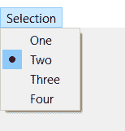
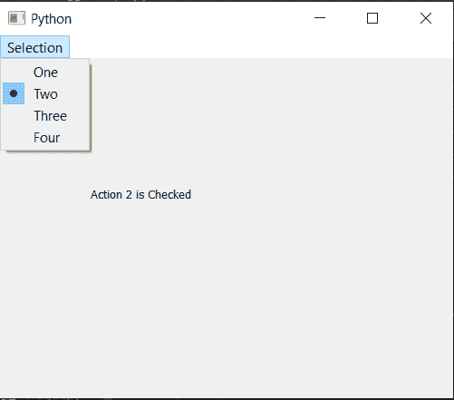

# pyqt 5–qactionggroup

> 哎哎哎:# t0]https://www . geeksforgeeks . org/pyqt 5-qactionggroup/

**QActionGroup :** 在 PyQt5 应用程序中，许多常见命令可以通过菜单、工具栏按钮和键盘快捷键来调用，因为用户希望每个命令都以相同的方式执行，而不管使用的用户界面如何，QAction 将每个命令表示为一个操作是有用的。在某些情况下，将 qaaction 对象组合在一起很有用，这样用户一次只能选择(检查)一个 qaaction，就像单选按钮一样。此外，为了显示动作组的效果，添加到其中的动作应该是可检查的。

以下是动作组中的动作在菜单
中的显示方式

语法:

```py
action_group = QActionGroup()

```

这个 action_group 是通过添加那些应该在同一个组中的 QAction 来使用的，它们可以借助`addAction`方法来添加。下面是一些经常与 QAction 一起使用的命令

```py
addAction : To add QAction to it

setEnabled : To make QActionGroup enable or disable

setExclusionPolicy : To set exclusion policy to the action group

checkedAction : It returns the currently checked action

removeAction : To remove the specific QAction from the group

actions : It returns the list of QAction group is having

```

**示例:**
在这里我们将创建一个菜单栏，它将有一个菜单，并有多个可检查的动作，下面是实现

```py
# importing libraries
from PyQt5.QtWidgets import * from PyQt5 import QtCore, QtGui
from PyQt5.QtGui import * from PyQt5.QtCore import * import sys

class Window(QMainWindow):

    def __init__(self):
        super().__init__()

        # setting title
        self.setWindowTitle("Python ")

        # setting geometry
        self.setGeometry(100, 100, 500, 400)

        # calling method
        self.UiComponents()

        # showing all the widgets
        self.show()

    # method for components
    def UiComponents(self):

        # creating a menu bar
        menubar = self.menuBar()

        # creating a selection menu
        selMenu = menubar.addMenu('Selection')

        # creating QAction Instances
        action1 = QAction("One", self)
        action2 = QAction("Two", self)
        action3 = QAction("Three", self)
        action4 = QAction("Four", self)

        # making actions checkable
        action1.setCheckable(True)
        action2.setCheckable(True)
        action3.setCheckable(True)
        action4.setCheckable(True)

        # adding these actions to the selection menu
        selMenu.addAction(action1)
        selMenu.addAction(action2)
        selMenu.addAction(action3)
        selMenu.addAction(action4)

        # creating a action group
        action_group = QActionGroup(self)

        # adding these action to the action group
        action_group.addAction(action1)
        action_group.addAction(action2)
        action_group.addAction(action3)
        action_group.addAction(action4)

        # creating a label
        label = QLabel("GeeksforGeeks", self)

        # setting geometry to the label
        label.setGeometry(100, 150, 200, 50)

        # adding triggered action to the first action
        action1.triggered.connect(lambda: label.setText("Action 1 is Checked"))

        # adding triggered action to the second action
        action2.triggered.connect(lambda: label.setText("Action 2 is Checked"))

        # adding triggered action to the third action
        action3.triggered.connect(lambda: label.setText("Action 3 is Checked"))

        # adding triggered action to the third action
        action4.triggered.connect(lambda: label.setText("Action 4 is Checked"))

# create pyqt5 app
App = QApplication(sys.argv)

# create the instance of our Window
window = Window()

# start the app
sys.exit(App.exec())
```

**输出:**


**另一个例子**
在这里我们将创建一个有多个动作的工具栏，这些动作由两个动作组组成，下面是实现

```py
# importing libraries
from PyQt5.QtWidgets import * from PyQt5 import QtCore, QtGui
from PyQt5.QtGui import * from PyQt5.QtCore import * import sys

class Window(QMainWindow):

    def __init__(self):
        super().__init__()

        # setting title 
        self.setWindowTitle("Python ")

        # setting geometry 
        self.setGeometry(100, 100, 500, 400)

        # calling method 
        self.UiComponents()

        # showing all the widgets 
        self.show()

        # method for components

    def UiComponents(self):
        # creating a tool bar
        toolbar = QToolBar(self)

        # setting geometry to the tool bar
        toolbar.setGeometry(50, 100, 300, 35)

        # creating QAction Instances
        action1 = QAction("One", self)
        action2 = QAction("Two", self)
        action3 = QAction("Three", self)
        action4 = QAction("Four", self)

        # making actions checkable
        action1.setCheckable(True)
        action2.setCheckable(True)
        action3.setCheckable(True)
        action4.setCheckable(True)

        # adding these actions to the tool bar
        toolbar.addAction(action1)
        toolbar.addAction(action2)
        toolbar.addAction(action3)
        toolbar.addAction(action4)

        # creating a first action group
        action_group1 = QActionGroup(self)

        # adding these action to the action group
        action_group1.addAction(action1)
        action_group1.addAction(action2)

        # creating a second action group
        action_group2 = QActionGroup(self)

        action_group2.addAction(action3)
        action_group2.addAction(action4)

        # creating a label
        label = QLabel("GeeksforGeeks", self)

        # setting geometry to the label
        label.setGeometry(100, 150, 200, 50)

        # adding triggered action to the first action
        action1.triggered.connect(lambda: label.setText("Action 1 is Checked"))

        # adding triggered action to the second action
        action2.triggered.connect(lambda: label.setText("Action 2 is Checked"))

        # adding triggered action to the third action
        action3.triggered.connect(lambda: label.setText("Action 3 is Checked"))

        # adding triggered action to the third action
        action4.triggered.connect(lambda: label.setText("Action 4 is Checked"))

# create pyqt5 app
App = QApplication(sys.argv)

# create the instance of our Window 
window = Window()

# start the app 
sys.exit(App.exec()) 
```

**输出:**

<video class="wp-video-shortcode" id="video-474082-1" width="640" height="512" preload="metadata" controls=""><source type="video/mp4" src="https://media.geeksforgeeks.org/wp-content/uploads/20200823233252/Python-2020-08-23-23-32-10.mp4?_=1">[https://media.geeksforgeeks.org/wp-content/uploads/20200823233252/Python-2020-08-23-23-32-10.mp4](https://media.geeksforgeeks.org/wp-content/uploads/20200823233252/Python-2020-08-23-23-32-10.mp4)</video>