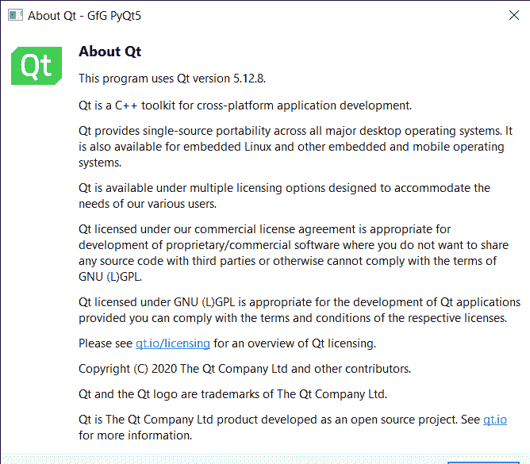

# pyqt 5–QA application

> 哎哎哎:# t0]https://www . geeksforgeeks . org/pyqt 5-qapplication/

QApplication 类管理图形用户界面应用程序的控制流和主要设置。它专门研究 QGuiApplication，提供基于 QWidget 的应用程序所需的一些功能。它处理小部件特定的初始化、终结。对于任何使用 Qt 的图形用户界面应用程序，无论应用程序在任何给定时间是否有 0、1、2 或更多窗口，都只有一个 QApplication 对象。对于非基于 QWidget 的 Qt 应用程序，请改用 QGuiApplication，因为它不依赖于 QtWidgets 库。

然后，我们创建一个窗口实例，并使用 sys.exit(App.exec())命令在事件循环中执行 qaapplication 对象，下面是一些与 qaapplication 对象一起使用的有用且常用的方法和属性。

> **语法:**App = qaapplication(sys . argv)
> 
> **参数:**
> 
> *   **哔声:**使用默认音量和声音鸣响铃声。该功能在嵌入式 Linux 的 Qt 中不可用
> *   **设置字体:**设置 PyQt5 应用程序的默认字体
> *   **关于 Qt:** 显示一个关于 Qt 的简单消息框。该消息包括应用程序正在使用的 Qt 的版本号。
> *   **关闭所有窗口:**关闭所有顶层窗口。该功能对于具有许多顶级窗口的应用程序特别有用。
> *   **setAutoSipEnabled:** 输入接受键盘输入的小部件时自动显示 SIP
> *   **设置光标闪烁时间:**该方法以毫秒为单位设置文本光标的闪烁时间
> *   **设置双击间隔:**此方法设置双击与连续两次鼠标单击的时间限制(毫秒)

**示例:**

我们将创建一个简单的 PyQt5 应用程序，当它被执行时会发出哔哔声，许多属性被设置到 QApplication 对象，下面是实现

## 蟒蛇 3

```
# importing libraries
from PyQt5.QtWidgets import *
from PyQt5 import QtCore, QtGui
from PyQt5.QtGui import *
from PyQt5.QtCore import *
import sys

class Window(QMainWindow):

    def __init__(self):
        super().__init__()

        # setting title
        self.setWindowTitle("Python ")

        # setting geometry
        self.setGeometry(100, 100, 500, 400)

        # calling method
        self.UiComponents()

        # showing all the widgets
        self.show()

    # method for components
    def UiComponents(self):

        # creating a push button
        push = QPushButton("Press", self)

        # setting geometry to the push button
        push.setGeometry(100, 100, 120, 40)

        # creating a label
        label = QLabel("GeeksforGeeks", self)

        # setting geometry to the label
        label.setGeometry(100, 160, 200, 50)

        # setting alignment to the label
        label.setAlignment(Qt.AlignCenter)

        # font
        font = QFont("Arial", 12)

        # setting font to the label
        label.setFont(font)

        # setting style sheet to the label
        label.setStyleSheet("QLabel"
                            "{"
                            "border : 2px solid green;"
                            "background : lightgreen;"
                            "}")

        # hiding the label
        label.hide()

        # adding action method to the push button
        push.clicked.connect(lambda: do_something())

        # method called by the push button when pressed
        def do_something():

            # unhide the label
            label.show()

# create pyqt5 app
App = QApplication(sys.argv)

# setting cursor flashtime
App.setCursorFlashTime(100)

# setting application object name
App.setObjectName("GfG")

# setting application display name
App.setApplicationDisplayName("GfG PyQt5")

# beep sound will occur when application
# is opened
App.beep()

# message displayed about the Qt
App.aboutQt()

# create the instance of our Window
window = Window()

# start the app
sys.exit(App.exec())
```

**输出:**
当我们首先执行代码时，将显示关于 Qt 页面



然后我们的应用程序将开始运行

<video class="wp-video-shortcode" id="video-491815-1" width="640" height="360" preload="metadata" controls=""><source type="video/mp4" src="https://media.geeksforgeeks.org/wp-content/uploads/20200825191840/Python-GfG-PyQt5-2020-08-25-19-15-46.mp4?_=1">[https://media.geeksforgeeks.org/wp-content/uploads/20200825191840/Python-GfG-PyQt5-2020-08-25-19-15-46.mp4](https://media.geeksforgeeks.org/wp-content/uploads/20200825191840/Python-GfG-PyQt5-2020-08-25-19-15-46.mp4)</video>