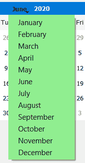
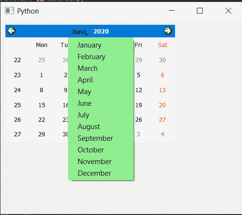

# PyQt5 QCalendarWidget–月份菜单的背景色

> 原文:[https://www . geeksforgeeks . org/pyqt5-qcalendarwidget-背景色-月份-菜单/](https://www.geeksforgeeks.org/pyqt5-qcalendarwidget-background-color-to-the-months-menu/)

在本文中，我们将看到如何为 QCalendarWidget 的月份菜单设置背景色。月菜单是日历的 QMenu 对象子对象，它在用户按下月名时出现，以便用户选择月份，将背景颜色设置为 QCalendarWidget 不同于将背景颜色设置为其他 Widget，日历是具有多个子组件的 widget，即我们也可以将背景颜色设置为独立组件。下面是月菜单上带有背景色的日历的外观



为此，我们将对 QCalendarWidget 对象使用`setStyleSheet`方法，下面是样式表代码

```py
QCalendarWidget QMenu
{
background-color : lightgreen;
}

```

下面是实现

```py
# importing libraries
from PyQt5.QtWidgets import * 
from PyQt5 import QtCore, QtGui
from PyQt5.QtGui import * 
from PyQt5.QtCore import * 
import sys

# QCalendarWidget Class
class Calendar(QCalendarWidget):

    # constructor
    def __init__(self, parent = None):
        super(Calendar, self).__init__(parent)

class Window(QMainWindow):

    def __init__(self):
        super().__init__()

        # setting title
        self.setWindowTitle("Python ")

        # setting geometry
        self.setGeometry(100, 100, 500, 400)

        # calling method
        self.UiComponents()

        # showing all the widgets
        self.show()

    # method for components
    def UiComponents(self):

        # creating a QCalendarWidget object
        # as Calendar class inherits QCalendarWidget
        self.calendar = Calendar(self)

        # setting cursor
        self.calendar.setCursor(Qt.PointingHandCursor)

        # setting size of the calendar
        self.calendar.resize(350, 240)

        # move the calendar
        self.calendar.move(10, 10)

        # setting stylesheet
        # adding background color to the calendar's menu
        self.calendar.setStyleSheet("QCalendarWidget QMenu"
                                    "{"
                                    "background-color : lightgreen;"
                                    "}"
                                    )

# create pyqt5 app
App = QApplication(sys.argv)

# create the instance of our Window
window = Window()

# start the app
sys.exit(App.exec())
```

**输出:**
