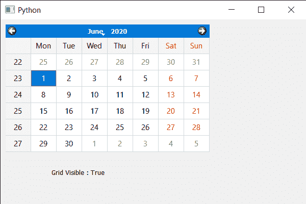

# PyQt5 QCalendarWidget–检查网格是否可见

> 原文:[https://www . geeksforgeeks . org/pyqt5-qcalendarwidget-checking-如果网格可见/](https://www.geeksforgeeks.org/pyqt5-qcalendarwidget-checking-if-grid-is-visible/)

在本文中，我们将看到如何检查网格在 QCalendarWidget 中是否可见。网格基本上是将日期相互分隔的相互连接的线网。默认情况下，QCalendarWidget 没有网格，尽管我们可以在 setGridVisible 方法的帮助下随时设置网格。下面是带有网格的日历的外观。


> 为此，我们将对 QCalendarWidget 对象使用 isGridVisible 方法。
> **语法:**calendar . isgrid visible()
> **参数:**不需要参数
> **返回:**返回 bool

下面是实现

## 蟒蛇 3

```py
# importing libraries
from PyQt5.QtWidgets import *
from PyQt5 import QtCore, QtGui
from PyQt5.QtGui import *
from PyQt5.QtCore import *
import sys

class Window(QMainWindow):

    def __init__(self):
        super().__init__()

        # setting title
        self.setWindowTitle("Python ")

        # setting geometry
        self.setGeometry(100, 100, 600, 400)

        # calling method
        self.UiComponents()

        # showing all the widgets
        self.show()

    # method for components
    def UiComponents(self):

        # creating a QCalendarWidget object
        calendar = QCalendarWidget(self)

        # setting geometry to the calendar
        calendar.setGeometry(10, 10, 400, 250)

        # setting grid
        calendar.setGridVisible(True)

        # creating label
        label = QLabel(self)

        # setting geometry to the label
        label.setGeometry(100, 270, 250, 60)

        # making label multi line
        label.setWordWrap(True)

        # checking if the calendar has grid
        check = calendar.isGridVisible()

        # setting text to the label
        label.setText("Grid Visible : " + str(check))

# create pyqt5 app
App = QApplication(sys.argv)

# create the instance of our Window
window = Window()

# start the app
sys.exit(App.exec())
```

**输出:**

