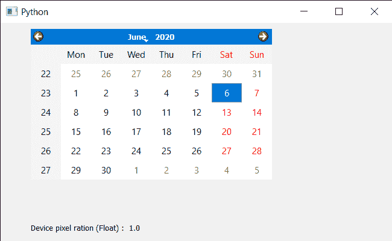

# PyQt5 QCalendarWidget–设备像素比浮动

> 原文:[https://www . geeksforgeeks . org/pyqt 5-qcalendarwidget-device-pixel-ratio-float/](https://www.geeksforgeeks.org/pyqt5-qcalendarwidget-device-pixel-ratio-float/)

在本文中，我们将看到如何获得设备像素比率，QCalendarWidget 的浮点值。设备像素比率是日历的物理像素和逻辑像素之间的比率。对于普通 dpi 显示器，常用值为 1；对于高 dpi“视网膜”显示器，常用值为 2；对于某些设备，常用值为十进制值，如 1.1、1.2 等。

> 为了做到这一点，我们将对 QCalendarWidget 对象使用 devicePixelRatioF 方法。
> **语法:**calendar . devicepixellratif()
> **参数:**不需要参数
> **返回:**返回 float

下面是实现

## 蟒蛇 3

```
# importing libraries
from PyQt5.QtWidgets import *
from PyQt5 import QtCore, QtGui
from PyQt5.QtGui import *
from PyQt5.QtCore import *
import sys

class Window(QMainWindow):

    def __init__(self):
        super().__init__()

        # setting title
        self.setWindowTitle("Python ")

        # setting geometry
        self.setGeometry(100, 100, 650, 400)

        # calling method
        self.UiComponents()

        # showing all the widgets
        self.show()

    # method for components
    def UiComponents(self):

        # creating a QCalendarWidget object
        self.calendar = QCalendarWidget(self)

        # setting geometry to the calendar
        self.calendar.setGeometry(50, 10, 400, 250)

        # setting cursor
        self.calendar.setCursor(Qt.PointingHandCursor)

        # creating a label
        label = QLabel(self)

        # setting geometry
        label.setGeometry(50, 280, 420, 120)

        # making it multi line
        label.setWordWrap(True)

        # getting device pixel ratio float
        value = self.calendar.devicePixelRatioF()

        # setting text to the label
        label.setText("Device pixel ration (Float) :  " + str(value))

# create pyqt5 app
App = QApplication(sys.argv)

# create the instance of our Window
window = Window()
window.calendar.destroy()

# start the app
sys.exit(App.exec())
```

**输出:**

