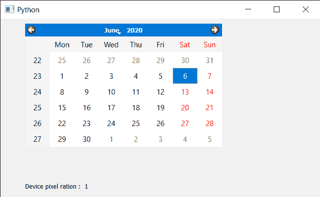

# PyQt5 QCalendarWidget–设备像素比

> 原文:[https://www . geeksforgeeks . org/pyqt 5-qcalendarwidget-device-pixel-ratio/](https://www.geeksforgeeks.org/pyqt5-qcalendarwidget-device-pixel-ratio/)

在本文中，我们将看到如何获得 QCalendarWidget 的设备像素比。设备像素比率是日历的物理像素和逻辑像素之间的比率。对于正常 dpi 显示器，常用值为 1，对于高 dpi“视网膜”显示器，常用值为 2。

> 为此，我们将对 QCalendarWidget 对象使用`devicePixelRatio`方法。
> 
> **语法:**行事历。devicepixelratio()
> 
> **论证:**不需要论证
> 
> **返回:**返回整数

下面是实现

```py
# importing libraries
from PyQt5.QtWidgets import * 
from PyQt5 import QtCore, QtGui
from PyQt5.QtGui import * 
from PyQt5.QtCore import * 
import sys

class Window(QMainWindow):

    def __init__(self):
        super().__init__()

        # setting title
        self.setWindowTitle("Python ")

        # setting geometry
        self.setGeometry(100, 100, 650, 400)

        # calling method
        self.UiComponents()

        # showing all the widgets
        self.show()

    # method for components
    def UiComponents(self):

        # creating a QCalendarWidget object
        self.calender = QCalendarWidget(self)

        # setting geometry to the calendar
        self.calender.setGeometry(50, 10, 400, 250)

        # setting cursor
        self.calender.setCursor(Qt.PointingHandCursor)

        # creating a label
        label = QLabel(self)

        # setting geometry
        label.setGeometry(50, 280, 420, 120)

        # making it multi line
        label.setWordWrap(True)

        # getting device pixel ratio
        value = self.calender.devicePixelRatio()

        # setting text to the label
        label.setText("Device pixel ration :  " + str(value))

# create pyqt5 app
App = QApplication(sys.argv)

# create the instance of our Window
window = Window()
window.calender.destroy()

# start the app
sys.exit(App.exec())
```

**输出:**
