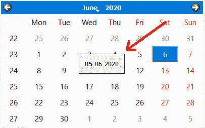

# PyQt5 QCalendarWidget–启用/禁用日期编辑弹出窗口

> 原文:[https://www . geesforgeks . org/pyqt5-qcalendarwidget-启用-禁用-日期-编辑-弹出/](https://www.geeksforgeeks.org/pyqt5-qcalendarwidget-enabling-disabling-date-edit-pop-up/)

在本文中，我们将看到如何启用/禁用 QCalendarWidget 的日期编辑弹出窗口。默认情况下，日期编辑弹出窗口处于启用状态，日期编辑在外观上比日期编辑更简单，但允许用户使用左右光标键在字段之间导航，使用上下光标键递增和递减单个字段，以及直接使用数字键输入值。下面是日期编辑弹出窗口的外观



> 为此，我们将对 QCalendarWidget 对象使用 setDateEditEnabled 方法。
> **语法:**calendar . setdate editenabled(True)
> **参数:**它以 bool 为参数
> **返回:**它不返回

下面是实现

## 蟒蛇 3

```
# importing libraries
from PyQt5.QtWidgets import *
from PyQt5 import QtCore, QtGui
from PyQt5.QtGui import *
from PyQt5.QtCore import *
import sys

class Window(QMainWindow):

    def __init__(self):
        super().__init__()

        # setting title
        self.setWindowTitle("Python ")

        # setting geometry
        self.setGeometry(100, 100, 650, 400)

        # calling method
        self.UiComponents()

        # showing all the widgets
        self.show()

    # method for components
    def UiComponents(self):

        # creating a QCalendarWidget object
        self.calendar = QCalendarWidget(self)

        # setting geometry to the calendar
        self.calendar.setGeometry(50, 10, 400, 250)

        # setting cursor
        self.calendar.setCursor(Qt.PointingHandCursor)

        # enabling the date edit popup
        self.calendar.setDateEditEnabled(True)

# create pyqt5 app
App = QApplication(sys.argv)

# create the instance of our Window
window = Window()

# start the app
sys.exit(App.exec())
```

**输出:**

<video class="wp-video-shortcode" id="video-426073-1" width="640" height="360" preload="metadata" controls=""><source type="video/mp4" src="https://media.geeksforgeeks.org/wp-content/uploads/20200606010905/Python-2020-06-06-01-08-38.mp4?_=1">[https://media.geeksforgeeks.org/wp-content/uploads/20200606010905/Python-2020-06-06-01-08-38.mp4](https://media.geeksforgeeks.org/wp-content/uploads/20200606010905/Python-2020-06-06-01-08-38.mp4)</video>