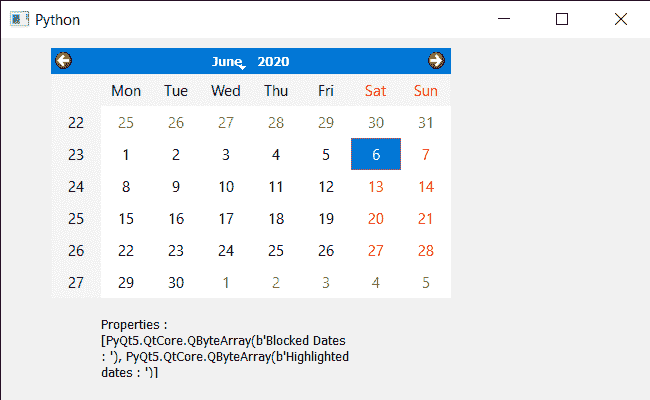

# PyQt5 QCalendarWidget–获取所有属性名称

> 原文:[https://www . geesforgeks . org/pyqt5-qcalendarwidget-get-all-property-name/](https://www.geeksforgeeks.org/pyqt5-qcalendarwidget-getting-all-the-property-names/)

在本文中，我们将看到如何获取 QCalendarWidget 的属性名称，属性是开发人员添加的信息，用于讲述日历的属性，例如，如果日历有一个阻止的未来日期，开发人员将添加该属性，以便其他开发人员可以看到该属性并了解该属性，可以借助 setProperty 方法添加该属性。

> 为此，我们将对 QCalendarWidget 对象使用 dynamicPropertyNames 方法。
> **语法:**calendar . dynamic property names()
> **参数:**不需要参数
> **返回:**返回列表

下面是实现

## 蟒蛇 3

```py
# importing libraries
from PyQt5.QtWidgets import *
from PyQt5 import QtCore, QtGui
from PyQt5.QtGui import *
from PyQt5.QtCore import *
import sys

class Window(QMainWindow):

    def __init__(self):
        super().__init__()

        # setting title
        self.setWindowTitle("Python ")

        # setting geometry
        self.setGeometry(100, 100, 650, 400)

        # calling method
        self.UiComponents()

        # showing all the widgets
        self.show()

    # method for components
    def UiComponents(self):

        # creating a QCalendarWidget object
        self.calendar = QCalendarWidget(self)

        # setting geometry to the calendar
        self.calendar.setGeometry(50, 10, 400, 250)

        # setting cursor
        self.calendar.setCursor(Qt.PointingHandCursor)

        # setting properties
        self.calendar.setProperty("Blocked Dates : ", 0)

        # setting properties
        self.calendar.setProperty("Highlighted dates : ", 0)

        # creating label to show the properties
        self.label = QLabel(self)

        # setting geometry to the label
        self.label.setGeometry(100, 280, 250, 60)

        # making label multi line
        self.label.setWordWrap(True)

        # getting the properties of calendar
        value = self.calendar.dynamicPropertyNames()

        # setting text to the label
        self.label.setText("Properties : " + str(value))

# create pyqt5 app
App = QApplication(sys.argv)

# create the instance of our Window
window = Window()
window.calendar.destroy()

# start the app
sys.exit(App.exec())
```

**输出:**

