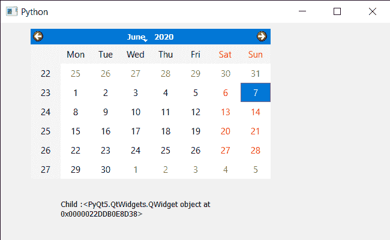

# PyQt5 QCalendarWidget–使用 ID 获取孩子

> 原文:[https://www . geeksforgeeks . org/pyqt 5-qcalendarwidget-get-child-use-id/](https://www.geeksforgeeks.org/pyqt5-qcalendarwidget-getting-child-using-id/)

在本文中，我们将看到如何使用子控件的 ID 找到 QCalendarWidget 的子控件。日历不是一个独立的小部件，它由称为子部件的小部件组成，例如年份的日期和数字显示框以及月份的下拉菜单共同组成日历。我们可以用儿童法得到孩子。

> 为此，我们将对 QCalendarWidget 对象使用 find 方法。
> **语法:** calendar.find(id)
> **自变量:**它以有效 id 对象作为自变量
> **返回:**它返回子对象

下面是实现

## 蟒蛇 3

```
# importing libraries
from PyQt5.QtWidgets import *
from PyQt5 import QtCore, QtGui
from PyQt5.QtGui import *
from PyQt5.QtCore import *
import sys

class Window(QMainWindow):

    def __init__(self):
        super().__init__()

        # setting title
        self.setWindowTitle("Python ")

        # setting geometry
        self.setGeometry(100, 100, 650, 400)

        # calling method
        self.UiComponents()

        # showing all the widgets
        self.show()

    # method for components
    def UiComponents(self):

        # creating a QCalendarWidget object
        self.calendar = QCalendarWidget(self)

        # setting geometry to the calendar
        self.calendar.setGeometry(50, 10, 400, 250)

        # setting cursor
        self.calendar.setCursor(Qt.PointingHandCursor)

        # creating label to show the properties
        self.label = QLabel(self)

        # setting geometry to the label
        self.label.setGeometry(100, 280, 250, 60)

        # making label multi line
        self.label.setWordWrap(True)

        # children
        children = self.calendar.children()

        c_id = children[3].winId()

        # getting child through ID
        value = self.calendar.find(c_id)

        # setting text to the label
        self.label.setText("Child :" + str(value))

# create pyqt5 app
App = QApplication(sys.argv)

# create the instance of our Window
window = Window()

# start the app
sys.exit(App.exec())
```

**输出:**

