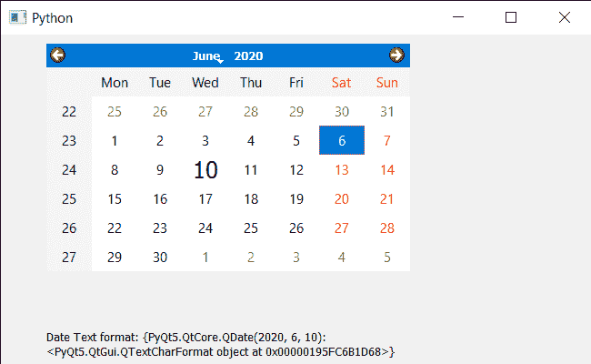

# PyQt5 QCalendarWidget–获取日期文本格式

> 原文:[https://www . geesforgeks . org/pyqt5-qcalendarwidget-get-date-text-format/](https://www.geeksforgeeks.org/pyqt5-qcalendarwidget-getting-date-text-format/)

在本文中，我们将看到如何在 QCalendarWidget 中将日期文本格式设置为特定日期。设置日期文本格式使指定的日期看起来更加特殊，例如增加大小和其他功能。下面是带有日期文本格式的日期的外观。


> 为此，我们将对 QCalendarWidget 对象使用 dateTextFormat 方法。
> **语法:**calendar . date textformat()
> **参数:**不需要参数
> **返回:**返回字典，其中键是 QDate 对象，值是 QTextCharFormat 对象

下面是实现

## 蟒蛇 3

```
# importing libraries
from PyQt5.QtWidgets import *
from PyQt5 import QtCore, QtGui
from PyQt5.QtGui import *
from PyQt5.QtCore import *
import sys

class Window(QMainWindow):

    def __init__(self):
        super().__init__()

        # setting title
        self.setWindowTitle("Python ")

        # setting geometry
        self.setGeometry(100, 100, 650, 400)

        # calling method
        self.UiComponents()

        # showing all the widgets
        self.show()

    # method for components
    def UiComponents(self):

        # creating a QCalendarWidget object
        self.calendar = QCalendarWidget(self)

        # setting geometry to the calendar
        self.calendar.setGeometry(50, 10, 400, 250)

        # setting cursor
        self.calendar.setCursor(Qt.PointingHandCursor)

        # format
        format = QTextCharFormat()
        format.setFont(QFont('Times', 15))

        # date
        date = QDate(2020, 6, 10)

        # setting date text format
        self.calendar.setDateTextFormat(date, format)

        # creating a label
        label = QLabel(self)

        # setting geometry
        label.setGeometry(50, 280, 420, 120)

        # making it multi line
        label.setWordWrap(True)

        # checking date text format
        value = self.calendar.dateTextFormat()

        # setting text to the label
        label.setText("Date Text format: " + str(value))

# create pyqt5 app
App = QApplication(sys.argv)

# create the instance of our Window
window = Window()

# start the app
sys.exit(App.exec())
```

**输出:**

