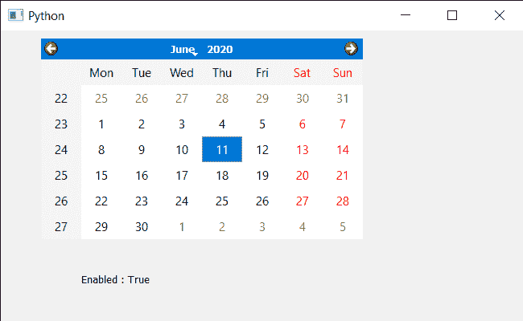

# PyQt5 QcalendarWidget–启用属性

> 原文:[https://www . geeksforgeeks . org/pyqt 5-qcalendarwidget-get-enabled-property/](https://www.geeksforgeeks.org/pyqt5-qcalendarwidget-getting-enabled-property/)

在本文中，我们将看到如何获得 QCalendarWidget 的 enabled 属性。Enabled 属性保存日历是否已启用。通常，启用的日历处理键盘和鼠标事件，而禁用的日历不处理。默认情况下，日历是启用的，尽管我们可以在 setEnabled 方法的帮助下设置 enabled 属性。

> 为此，我们将对 QCalendarWidget 对象使用 isEnabled 方法。
> **语法:** calendar.isEnabled()
> **参数:**不需要参数
> **返回:**返回 bool

下面是实现

## 蟒蛇 3

```
# importing libraries
from PyQt5.QtWidgets import *
from PyQt5 import QtCore, QtGui
from PyQt5.QtGui import *
from PyQt5.QtCore import *
import sys

class Window(QMainWindow):

    def __init__(self):
        super().__init__()

        # setting title
        self.setWindowTitle("Python ")

        # setting geometry
        self.setGeometry(100, 100, 650, 400)

        # calling method
        self.UiComponents()

        # showing all the widgets
        self.show()

    # method for components
    def UiComponents(self):

        # creating a QCalendarWidget object
        self.calendar = QCalendarWidget(self)

        # setting geometry to the calendar
        self.calendar.setGeometry(50, 10, 400, 250)

        # setting cursor
        self.calendar.setCursor(Qt.PointingHandCursor)

        # creating label to show the properties
        self.label = QLabel(self)

        # setting geometry to the label
        self.label.setGeometry(100, 280, 250, 60)

        # making label multi line
        self.label.setWordWrap(True)

        # checking if the calendar is enabled
        value = self.calendar.isEnabled()

        # setting text to the label
        self.label.setText("Enabled : " + str(value))

# create pyqt5 app
App = QApplication(sys.argv)

# create the instance of our Window
window = Window()

# start the app
sys.exit(App.exec())
```

**输出:**

