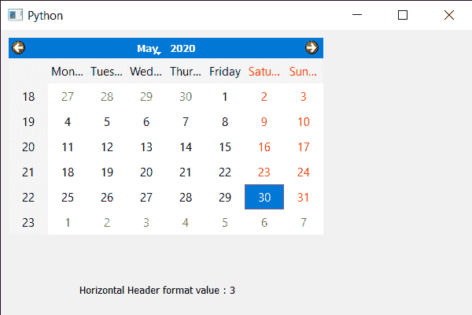

# PyQt5 QCalendarWidget–获取水平标题格式

> 原文:[https://www . geeksforgeeks . org/pyqt5-qcalendarwidget-get-horizontal-header-format/](https://www.geeksforgeeks.org/pyqt5-qcalendarwidget-getting-horizontal-header-format/)

在本文中，我们将看到如何获得 QCalendarWidget 的水平标题格式。水平标题是 QCalendarWidget 中显示日期名称的位置，默认情况下显示日期的短格式，例如，周一显示为周一。默认情况下，短日期名称是水平标题的格式，尽管我们可以在 setHorizontalHeaderFormat 方法的帮助下更改它。

有许多格式可用于水平标题，如 SingleLetterDayNames，其值为 1，此格式仅显示日期名称的第一个字母，ShortDayNames，它是默认格式，其值为 2，此格式仅显示日期名称的短形式。LongDayNames 它的值是 3，这种格式显示一天的完整名称。

> 为此，我们对 QCalendarWidget 对象
> **使用 horizontalHeaderFormat 方法语法:**calendar . horizontalHeaderFormat()
> **参数:**它不接受参数
> **返回:**它返回水平标题格式对象，但是当打印时，它显示与之相关的值

下面是实现

## 蟒蛇 3

```
# importing libraries
from PyQt5.QtWidgets import *
from PyQt5 import QtCore, QtGui
from PyQt5.QtGui import *
from PyQt5.QtCore import *
import sys

class Window(QMainWindow):

    def __init__(self):
        super().__init__()

        # setting title
        self.setWindowTitle("Python ")

        # setting geometry
        self.setGeometry(100, 100, 600, 400)

        # calling method
        self.UiComponents()

        # showing all the widgets
        self.show()

    # method for components
    def UiComponents(self):

        # creating a QCalendarWidget object
        calendar = QCalendarWidget(self)

        # setting geometry to the calendar
        calendar.setGeometry(10, 10, 400, 250)

        # setting calendar horizontal header format
        calendar.setHorizontalHeaderFormat(QCalendarWidget.LongDayNames)

        # creating a label
        label = QLabel(self)

        # setting geometry to the label
        label.setGeometry(100, 300, 250, 60)

        # making label multi line
        label.setWordWrap(True)

        # getting the horizontal header format
        value = calendar.horizontalHeaderFormat()

        # setting text to the label
        label.setText("Horizontal Header format value : " + str(value))

# create pyqt5 app
App = QApplication(sys.argv)

# create the instance of our Window
window = Window()

# start the app
sys.exit(App.exec())
```

**输出:**

