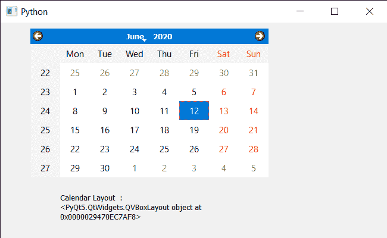

# PyQt5 QCalendarWidget–获取其布局

> 原文:[https://www . geeksforgeeks . org/pyqt 5-qcalendarwidget-get-its-layout/](https://www.geeksforgeeks.org/pyqt5-qcalendarwidget-getting-its-layout/)

在本文中，我们将看到如何获得 QCalendarWidget 的布局。为此，我们使用`layout`方法，它返回安装在日历上的布局管理器，如果没有安装布局管理器，则返回无。布局管理器设置已添加到布局中的日历子项的几何图形。

> 为此，我们将对 QCalendarWidget 对象使用`layout`方法。
> 
> **语法:**日历.布局()
> 
> **论证:**不需要论证
> 
> **返回:**返回 QLayout 对象

下面是实现

```
# importing libraries
from PyQt5.QtWidgets import * 
from PyQt5 import QtCore, QtGui
from PyQt5.QtGui import * 
from PyQt5.QtCore import * 
import sys

class Window(QMainWindow):

    def __init__(self):
        super().__init__()

        # setting title
        self.setWindowTitle("Python ")

        # setting geometry
        self.setGeometry(100, 100, 650, 400)

        # calling method
        self.UiComponents()

        # showing all the widgets
        self.show()

    # method for components
    def UiComponents(self):

        # creating a QCalendarWidget object
        self.calendar = QCalendarWidget(self)

        # setting geometry to the calender
        self.calendar.setGeometry(50, 10, 400, 250)

        # setting cursor
        self.calendar.setCursor(Qt.PointingHandCursor)

        # creating label to show the properties
        self.label = QLabel(self)

        # setting geometry to the label
        self.label.setGeometry(100, 280, 250, 60)

        # making label multi line
        self.label.setWordWrap(True)

        # getting layout
        value = self.calendar.layout()

        # setting text to the label
        self.label.setText("Calendar Layout  : " + str(value))

# create pyqt5 app
App = QApplication(sys.argv)

# create the instance of our Window
window = Window()

# start the app
sys.exit(App.exec())
```

**输出:**
