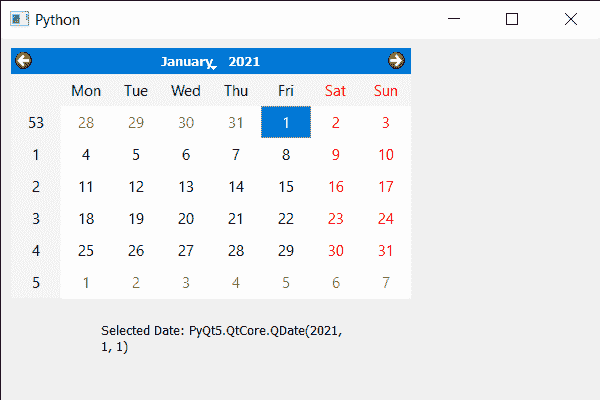

# PyQt5 QCalendarWidget–获取选定日期

> 原文:[https://www . geesforgeks . org/pyqt5-qcalendarwidget-get-selected-date/](https://www.geeksforgeeks.org/pyqt5-qcalendarwidget-getting-selected-date/)

在本文中，我们将看到如何获取 QCalendarWidget 的选定日期，选定日期是当前高亮显示的日期，用户可以使用鼠标和光标更改选定日期默认情况下，选定日期是实时日期，尽管我们可以借助 setSelectedDate 方法随时设置选定日期。

**注意:**所选日期必须在最小日期和最大日期属性指定的日期范围内。

> 为此，我们将对 QCalendarWidget 对象使用 selectedDate 方法。
> **语法:**calendar . selecteddate(date)
> **参数:**不需要参数
> **返回:**返回 QDate 对象

下面是实现

## 蟒蛇 3

```py
# importing libraries
from PyQt5.QtWidgets import *
from PyQt5 import QtCore, QtGui
from PyQt5.QtGui import *
from PyQt5.QtCore import *
import sys

class Window(QMainWindow):

    def __init__(self):
        super().__init__()

        # setting title
        self.setWindowTitle("Python ")

        # setting geometry
        self.setGeometry(100, 100, 600, 400)

        # calling method
        self.UiComponents()

        # showing all the widgets
        self.show()

    # method for components
    def UiComponents(self):

        # creating a QCalendarWidget object
        calendar = QCalendarWidget(self)

        # setting geometry to the calendar
        calendar.setGeometry(10, 10, 400, 250)

        # date
        date = QDate(2021, 1, 1)

        # setting selected date
        calendar.setSelectedDate(date)

        # creating label
        label = QLabel(self)

        # setting geometry to the label
        label.setGeometry(100, 270, 250, 60)

        # making label multi line
        label.setWordWrap(True)

        # getting the selected date
        value = calendar.selectedDate()

        # setting text to the label
        label.setText("Selected Date: " + str(value))

# create pyqt5 app
App = QApplication(sys.argv)

# create the instance of our Window
window = Window()

# start the app
sys.exit(App.exec())
```

**输出:**

