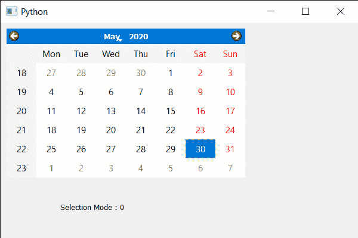

# PyQt5 QCalendarWidget–获取选择模式

> 原文:[https://www . geeksforgeeks . org/pyqt 5-qcalendarwidget-get-the-selection-mode/](https://www.geeksforgeeks.org/pyqt5-qcalendarwidget-getting-the-selection-mode/)

在本文中，我们将看到如何获得 QCalendarWidget 的选择模式。选择模式基本上是日历的质量如何选择日期。QCalendarWidget 有两种模式，第一种是 NoSelection 模式，其值为 0，在这种模式下，无法选择日期。另一个是 SingleSelection，它是默认模式，它的值是 1，在这个模式下一次可以选择一个日期。我们使用 setSelectionMode 方法为 QCalendarWidget 对象设置模式。

> 为此，我们将对 QCalendarWidget 对象使用 selectionMode 方法。
> **语法:**calendar . selection mode()
> **参数:**不需要参数
> **Return :** 返回选择模式对象，但打印时显示与模式相关联的值。

下面是实现

## 蟒蛇 3

```py
# importing libraries
from PyQt5.QtWidgets import *
from PyQt5 import QtCore, QtGui
from PyQt5.QtGui import *
from PyQt5.QtCore import *
import sys

class Window(QMainWindow):

    def __init__(self):
        super().__init__()

        # setting title
        self.setWindowTitle("Python ")

        # setting geometry
        self.setGeometry(100, 100, 600, 400)

        # calling method
        self.UiComponents()

        # showing all the widgets
        self.show()

    # method for components
    def UiComponents(self):

        # creating a QCalendarWidget object
        calendar = QCalendarWidget(self)

        # setting geometry to the calendar
        calendar.setGeometry(10, 10, 400, 250)

        # setting selection mode
        calendar.setSelectionMode(QCalendarWidget.NoSelection)

        # creating a label
        label = QLabel(self)

        # setting geometry to the label
        label.setGeometry(100, 280, 250, 60)

        # making label multi line
        label.setWordWrap(True)

        # getting the selection mode
        value = calendar.selectionMode()

        # setting text to the label
        label.setText("Selection Mode : " + str(value))

# create pyqt5 app
App = QApplication(sys.argv)

# create the instance of our Window
window = Window()

# start the app
sys.exit(App.exec())
```

**输出:**

