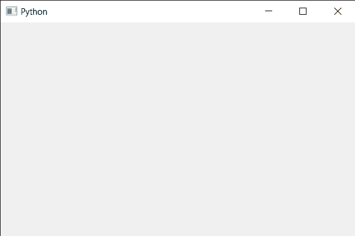

# PyQt5 QCalendarWidget–隐藏属性

> 原文:[https://www . geeksforgeeks . org/pyqt 5-qcalendarwidget-hidden-property/](https://www.geeksforgeeks.org/pyqt5-qcalendarwidget-hidden-property/)

在本文中，我们将看到如何使用 hidden 属性隐藏和取消隐藏 QCalendarWidget，隐藏与显示 QCalendarWidget 完全相反。日历小部件是一个大部件，因此当用户不需要它时，需要隐藏它。我们可以使用`hide`方法隐藏它，但不能使用相同的方法取消隐藏。

> 为此，我们将对 QCalendarWidget 对象使用`setHidden`方法。
> 
> **语法:**日历.设置隐藏(真)
> 
> **自变量:**以布尔为自变量，即真表示隐藏，假表示不隐藏
> 
> **返回:**返回无

下面是实现

```py
# importing libraries
from PyQt5.QtWidgets import * 
from PyQt5 import QtCore, QtGui
from PyQt5.QtGui import * 
from PyQt5.QtCore import * 
import sys

class Window(QMainWindow):

    def __init__(self):
        super().__init__()

        # setting title
        self.setWindowTitle("Python ")

        # setting geometry
        self.setGeometry(100, 100, 600, 400)

        # calling method
        self.UiComponents()

        # showing all the widgets
        self.show()

    # method for components
    def UiComponents(self):

        # creating a QCalendarWidget object
        calender = QCalendarWidget(self)

        # setting geometry to the calender
        calender.setGeometry(10, 10, 400, 250)

        # setting grid
        calender.setGridVisible(True)

        # hiding the calendar using set hidden property
        calender.setHidden(True)

# create pyqt5 app
App = QApplication(sys.argv)

# create the instance of our Window
window = Window()

# start the app
sys.exit(App.exec())
```

**输出:**
