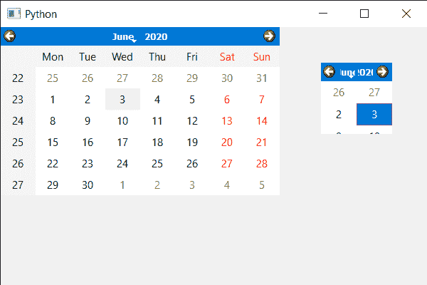

# PyQt5 QCalendarWidget–让尺寸完美契合

> 原文:[https://www . geeksforgeeks . org/pyqt 5-qcalendarwidget-making-size-perfect-fit/](https://www.geeksforgeeks.org/pyqt5-qcalendarwidget-making-size-perfectly-fit/)

在本文中，我们将看到如何根据外观使 QCalendarWidget 的大小完美匹配，即大小不应该更大或更小。日历是一个很大的小部件，因此有时设计师会错误地缩小尺寸，只有日历的一部分是可见的。它可以通过手动改变大小来调整，但这需要时间的打击和试验方法，也不会准确。

> 为此，我们将对 QCalendarWidget 对象使用 adjustSize 方法。
> **语法:**日历. adjustize()
> **参数:**不需要参数
> **执行的操作:**返回 None

下面是实现

## 蟒蛇 3

```py
# importing libraries
from PyQt5.QtWidgets import *
from PyQt5 import QtCore, QtGui
from PyQt5.QtGui import *
from PyQt5.QtCore import *
import sys

class Window(QMainWindow):

    def __init__(self):
        super().__init__()

        # setting title
        self.setWindowTitle("Python ")

        # setting geometry
        self.setGeometry(100, 100, 600, 400)

        # calling method
        self.UiComponents()

        # showing all the widgets
        self.show()

    # method for components
    def UiComponents(self):

        # creating a QCalendarWidget object
        self.calendar = QCalendarWidget(self)

        # setting geometry to the calendar
        self.calendar.setGeometry(450, 50, 100, 100)

        # creating another calendar
        geek_calendar = QCalendarWidget(self)

        # adjusting the size of geek calendar
        geek_calendar.adjustSize()

# create pyqt5 app
App = QApplication(sys.argv)

# create the instance of our Window
window = Window()

# start the app
sys.exit(App.exec())
```

**输出:**

