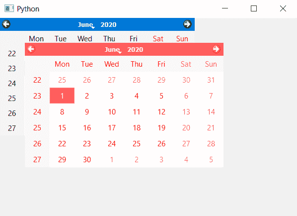

# PyQt5 QCalendarWidget–将其移动到父堆栈的顶部

> 原文:[https://www . geeksforgeeks . org/pyqt 5-qcalendarwidget-将它移动到父堆栈顶部/](https://www.geeksforgeeks.org/pyqt5-qcalendarwidget-moving-it-to-the-top-of-the-parent-stack/)

在本文中，我们将看到如何在父堆栈的顶部制作 QCalendarWidget。在将 QCalendarWidget 放在堆栈的较低位置后，QcalendarWidget 将在视觉上位于任何重叠的同级小部件的前面。

> 为此，我们将对 QCalendarWidget 对象使用`raise_`方法。
> 
> **语法:** calendar.raise_()
> 
> **论证:**不需要论证
> 
> **返回:**返回无

下面是实现

```py
# importing libraries
from PyQt5.QtWidgets import * 
from PyQt5 import QtCore, QtGui
from PyQt5.QtGui import * 
from PyQt5.QtCore import * 
import sys

class Window(QMainWindow):

    def __init__(self):
        super().__init__()

        # setting title
        self.setWindowTitle("Python ")

        # setting geometry
        self.setGeometry(100, 100, 600, 400)

        # calling method
        self.UiComponents()

        # showing all the widgets
        self.show()

    # method for components
    def UiComponents(self):

        # creating a QCalendarWidget object
        self.calendar = QCalendarWidget(self)

        # setting geometry to the calender
        self.calendar.setGeometry(50, 50, 400, 250)

        # adding color effect to the calendar
        color = QGraphicsColorizeEffect()
        color.setColor(Qt.red)
        self.calendar.setGraphicsEffect(color)

        # creating a another calendar
        another_calendar = QCalendarWidget(self)

        # adjusting the size of another calendar
        another_calendar.adjustSize()

        # making this calendar at top of the stack
        self.calendar.raise_()

# create pyqt5 app
App = QApplication(sys.argv)

# create the instance of our Window
window = Window()

# start the app
sys.exit(App.exec())
```

**输出:**
