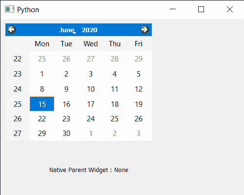

# pyqt 5 qcalendarwdget–原生父元件

> 原文:[https://www . geeksforgeeks . org/pyqt 5-qcalendarwidget-native-parent-widget/](https://www.geeksforgeeks.org/pyqt5-qcalendarwidget-native-parent-widget/)

在本文中，我们将看到如何获得 QCalendarWidget 的原生父小部件。为此，我们使用`nativeParentWidget`方法，该方法返回日历的原生父代，即具有系统标识符的下一个祖先小部件，如果它没有任何原生父代，则返回无。

> 为此，我们将对 QCalendarWidget 对象使用`nativeParentWidget`方法。
> 
> **语法:**calendar . nativeperentwidget()
> 
> **论证:**不需要论证
> 
> **返回:**返回 QWidget 对象

下面是实现

```py
# importing libraries
from PyQt5.QtWidgets import * 
from PyQt5 import QtCore, QtGui
from PyQt5.QtGui import * 
from PyQt5.QtCore import * 
import sys

# QCalendarWidget Class
class Calendar(QCalendarWidget):

    # constructor
    def __init__(self, parent = None):
        super(Calendar, self).__init__(parent)

class Window(QMainWindow):

    def __init__(self):
        super().__init__()

        # setting title
        self.setWindowTitle("Python ")

        # setting geometry
        self.setGeometry(100, 100, 500, 400)

        # calling method
        self.UiComponents()

        # showing all the widgets
        self.show()

    # method for components
    def UiComponents(self):

        # creating a QCalendarWidget object
        # as Calendar class inherits QCalendarWidget
        self.calendar = Calendar(self)

        # setting cursor
        self.calendar.setCursor(Qt.PointingHandCursor)

        # setting size of the calendar
        self.calendar.resize(300, 240)

        # move the calendar
        self.calendar.move(10, 10)

        # creating a label
        label = QLabel(self)

        # setting geometry to the label
        label.setGeometry(100, 280, 250, 60)

        # making label multi line
        label.setWordWrap(True)

        # getting the native parent widget
        value = self.calendar.nativeParentWidget()

        # setting text to the label
        label.setText("Native Parent Widget : " + str(value))

# create pyqt5 app
App = QApplication(sys.argv)

# create the instance of our Window
window = Window()

# start the app
sys.exit(App.exec())
```

**输出:**
