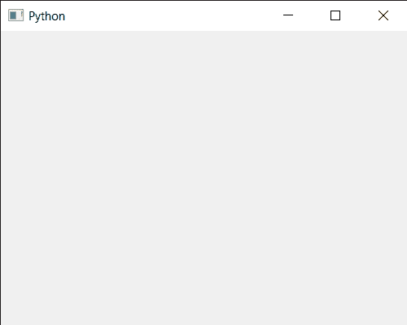

# PyQt5 QCalendarWidget–覆盖窗口标志

> 原文:[https://www . geesforgeks . org/pyqt5-qcalendarwidget-override-the-window-flags/](https://www.geeksforgeeks.org/pyqt5-qcalendarwidget-override-the-window-flags/)

在本文中，我们将看到如何覆盖 QCalendarWidget 的窗口标志。为了做到这一点，我们使用`overrideWindowFlags`方法，该方法将日历的窗口标志设置为 flags，而不通知窗口系统。

**警告:**除非你真的知道自己在做什么，否则不要调用这个函数。

> 为此，我们将对 QCalendarWidget 对象使用`overrideWindowFlags`方法。
> 
> **语法:**calendar . overridedwindowflags(flag)
> 
> **自变量:**以窗口标志对象为自变量
> 
> **返回:**不返回

下面是实现

```
# importing libraries
from PyQt5.QtWidgets import * 
from PyQt5 import QtCore, QtGui
from PyQt5.QtGui import * 
from PyQt5.QtCore import * 
import sys

# QCalendarWidget Class
class Calendar(QCalendarWidget):

    # constructor
    def __init__(self, parent = None):
        super(Calendar, self).__init__(parent)

class Window(QMainWindow):

    def __init__(self):
        super().__init__()

        # setting title
        self.setWindowTitle("Python ")

        # setting geometry
        self.setGeometry(100, 100, 500, 400)

        # calling method
        self.UiComponents()

        # showing all the widgets
        self.show()

    # method for components
    def UiComponents(self):

        # creating a QCalendarWidget object
        # as Calendar class inherits QCalendarWidget
        self.calendar = Calendar(self)

        # setting cursor
        self.calendar.setCursor(Qt.PointingHandCursor)

        # setting size of the calendar
        self.calendar.resize(300, 240)

        # move the calendar
        self.calendar.move(10, 10)

        # setting override windows flag
        self.calendar.overrideWindowFlags(Qt.SplashScreen)

# create pyqt5 app
App = QApplication(sys.argv)

# create the instance of our Window
window = Window()

# start the app
sys.exit(App.exec())
```

**输出:**
