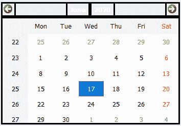

# PyQt5 QCalendarWidget–设置边框

> 原文:[https://www . geeksforgeeks . org/pyqt 5-qcalendarwidget-setting-border/](https://www.geeksforgeeks.org/pyqt5-qcalendarwidget-setting-border/)

在本文中，我们将看到如何为 QCalendarWidget 设置边框，将边框设置为 QCalendarWidget 不同于为其他小部件设置边框，日历是一个有多个子部件的小部件，也就是说，我们可以将边框设置为独立部件。下面是带边框的日历的外观



为此，我们将对 QCalendarWidget 对象使用`setStyleSheet`方法，下面是样式表代码

```
border : 3px solid black;

```

**注意:**这将删除日历的所有先前的样式表

下面是实现

```
# importing libraries
from PyQt5.QtWidgets import * 
from PyQt5 import QtCore, QtGui
from PyQt5.QtGui import * 
from PyQt5.QtCore import * 
import sys

# QCalendarWidget Class
class Calendar(QCalendarWidget):

    # constructor
    def __init__(self, parent = None):
        super(Calendar, self).__init__(parent)

class Window(QMainWindow):

    def __init__(self):
        super().__init__()

        # setting title
        self.setWindowTitle("Python ")

        # setting geometry
        self.setGeometry(100, 100, 500, 400)

        # calling method
        self.UiComponents()

        # showing all the widgets
        self.show()

    # method for components
    def UiComponents(self):

        # creating a QCalendarWidget object
        # as Calendar class inherits QCalendarWidget
        self.calendar = Calendar(self)

        # setting cursor
        self.calendar.setCursor(Qt.PointingHandCursor)

        # setting size of the calendar
        self.calendar.resize(350, 240)

        # move the calendar
        self.calendar.move(10, 10)

        # setting stylesheet
        # adding border to it
        self.calendar.setStyleSheet("border : 3px solid black;")

# create pyqt5 app
App = QApplication(sys.argv)

# create the instance of our Window
window = Window()

# start the app
sys.exit(App.exec())
```

**输出:**

<video class="wp-video-shortcode" id="video-434805-1" width="640" height="512" preload="metadata" controls=""><source type="video/mp4" src="https://media.geeksforgeeks.org/wp-content/uploads/20200617004636/Python-2020-06-17-00-46-02.mp4?_=1">[https://media.geeksforgeeks.org/wp-content/uploads/20200617004636/Python-2020-06-17-00-46-02.mp4](https://media.geeksforgeeks.org/wp-content/uploads/20200617004636/Python-2020-06-17-00-46-02.mp4)</video>