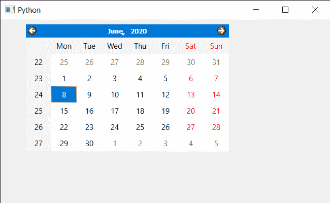

# PyQt5 QCalendarWidget–设置编辑焦点属性

> 原文:[https://www . geeksforgeeks . org/pyqt 5-qcalendarwidget-setting-edit-focus-property/](https://www.geeksforgeeks.org/pyqt5-qcalendarwidget-setting-edit-focus-property/)

在本文中，我们将看到如何将编辑焦点设置到 QCalendarWidget。如果启用此属性，它将使日历具有编辑焦点，在这种情况下，Qt::Key_Up 和 Qt::Key_Down 将正常传递给日历；否则，使用 Qt::Key_Up 和 Qt::Key_Down 来改变焦点。

**注意:**此功能仅在嵌入式 Linux 的 Qt 中可用。

> 为此，我们将对 QCalendarWidget 对象使用`setEditFocus`方法。
> 
> **语法:**日历. setEditFocus(True)
> 
> **自变量:**它以布尔为自变量
> 
> **返回:**不返回

下面是实现

```py
# importing libraries
from PyQt5.QtWidgets import * 
from PyQt5 import QtCore, QtGui
from PyQt5.QtGui import * 
from PyQt5.QtCore import * 
import sys

class Window(QMainWindow):

    def __init__(self):
        super().__init__()

        # setting title
        self.setWindowTitle("Python ")

        # setting geometry
        self.setGeometry(100, 100, 650, 400)

        # calling method
        self.UiComponents()

        # showing all the widgets
        self.show()

    # method for components
    def UiComponents(self):

        # creating a QCalendarWidget object
        self.calendar = QCalendarWidget(self)

        # setting geometry to the calender
        self.calendar.setGeometry(50, 10, 400, 250)

        # setting cursor
        self.calendar.setCursor(Qt.PointingHandCursor)

        # enabling edit focus
        self.calendar.setEditFocus(True)

# create pyqt5 app
App = QApplication(sys.argv)

# create the instance of our Window
window = Window()

# start the app
sys.exit(App.exec())
```

**输出:**
