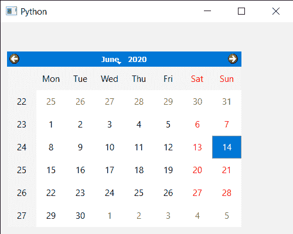

# PyQt5 QCalendarWidget–设置固定大小

> 原文:[https://www . geeksforgeeks . org/pyqt 5-qcalendarwidget-setting-fixed-size/](https://www.geeksforgeeks.org/pyqt5-qcalendarwidget-setting-fixed-size/)

在本文中，我们将看到如何将固定大小设置为 QCalendarWidget。日历的固定大小是指在此之后不能再进一步扩展或缩小的大小，默认情况下，当我们在布局内创建日历时，当窗口扩展或缩小时，日历的大小也会增加或缩小，因此，有必要设置固定大小。我们可以分别借助`setFixedWidth`和`setFixedHeight`方法单独设置固定的宽度和高度。

> 为此，我们将对 QCalendarWidget 对象使用`setFixedSize`方法。
> 
> **语法:** calendar.setFixedSize(大小)
> 
> **自变量:**它以 QSize 对象为自变量
> 
> **返回:**不返回

下面是实现

```py
# importing libraries
from PyQt5.QtWidgets import * 
from PyQt5 import QtCore, QtGui
from PyQt5.QtGui import * 
from PyQt5.QtCore import * 
import sys

# QCalendarWidget Class
class Calendar(QCalendarWidget):

    # constructor
    def __init__(self, parent = None):
        super(Calendar, self).__init__(parent)
        self.setMouseTracking(True)

class Window(QMainWindow):

    def __init__(self):
        super().__init__()

        # setting title
        self.setWindowTitle("Python ")

        # setting geometry
        self.setGeometry(100, 100, 500, 400)

        # calling method
        self.UiComponents()

        # showing all the widgets
        self.show()

    # method for components
    def UiComponents(self):

        # creating a layout
        layout = QVBoxLayout()

        # creating a QCalendarWidget object
        # as Calendar class inherits QCalendarWidget
        self.calendar = Calendar(self)

        # setting cursor
        self.calendar.setCursor(Qt.PointingHandCursor)

        # adding calendar tot he layout
        layout.addWidget(self.calendar)

        # setting fixed size
        self.calendar.setFixedSize(QSize(400, 300))

        # setting layout
        widget = QWidget()
        widget.setLayout(layout)
        self.setCentralWidget(widget)

# create pyqt5 app
App = QApplication(sys.argv)

# create the instance of our Window
window = Window()

# start the app
sys.exit(App.exec())
```

**输出:**
