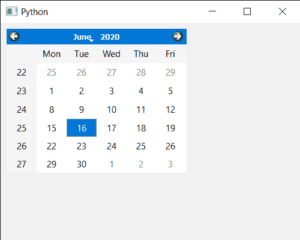

# PyQt5 QCalendarWidget–设置对象名称属性

> 原文:[https://www . geeksforgeeks . org/pyqt 5-qcalendarwidget-setting-object-name-property/](https://www.geeksforgeeks.org/pyqt5-qcalendarwidget-setting-object-name-property/)

在本文中，我们将看到如何将对象名设置为 QCalendarWidget。对象名基本上就是给日历的对象起的名字，我们可以借助对象名找到 PyQt5 应用中的对象，我们可以借助`findChild`方法找到它。

> 为此，我们将对 QCalendarWidget 对象使用`setObjectName`方法。
> 
> **语法:** calendar.setObjectName(名称)
> 
> **自变量:**以字符串为自变量
> 
> **返回:**不返回

下面是实现

```
# importing libraries
from PyQt5.QtWidgets import * 
from PyQt5 import QtCore, QtGui
from PyQt5.QtGui import * 
from PyQt5.QtCore import * 
import sys

# QCalendarWidget Class
class Calendar(QCalendarWidget):

    # constructor
    def __init__(self, parent = None):
        super(Calendar, self).__init__(parent)

class Window(QMainWindow):

    def __init__(self):
        super().__init__()

        # setting title
        self.setWindowTitle("Python ")

        # setting geometry
        self.setGeometry(100, 100, 500, 400)

        # calling method
        self.UiComponents()

        # showing all the widgets
        self.show()

    # method for components
    def UiComponents(self):

        # creating a QCalendarWidget object
        # as Calendar class inherits QCalendarWidget
        self.calendar = Calendar(self)

        # setting cursor
        self.calendar.setCursor(Qt.PointingHandCursor)

        # setting size of the calendar
        self.calendar.resize(300, 240)

        # move the calendar
        self.calendar.move(10, 10)

        # setting object name of calendar
        self.calendar.setObjectName("Geek")

# create pyqt5 app
App = QApplication(sys.argv)

# create the instance of our Window
window = Window()

# start the app
sys.exit(App.exec())
```

**输出:**
