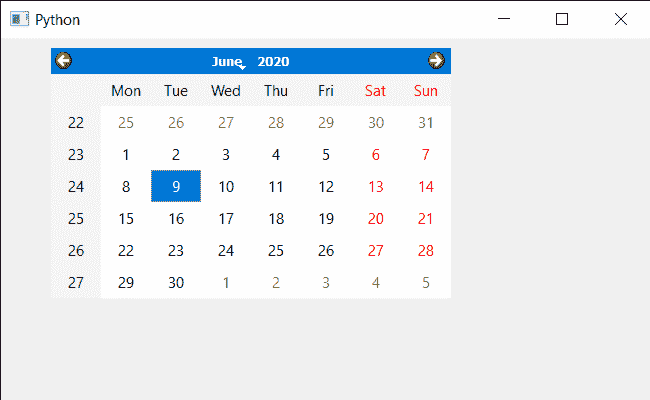

# PyQt5 QCalendarWidget–设置平板电脑跟踪属性

> 原文:[https://www . geeksforgeeks . org/pyqt 5-qcalendarwidget-setting-table t-tracking-property/](https://www.geeksforgeeks.org/pyqt5-qcalendarwidget-setting-tablet-tracking-property/)

在本文中，我们将看到如何将平板电脑跟踪属性设置为 QCalendarWidget。如果禁用了数位板跟踪(默认)，则日历仅在手写笔与数位板接触或在移动手写笔时至少按下一个手写笔按钮时接收数位板移动事件。如果启用了平板电脑跟踪，即使在附近悬停，日历也会接收平板电脑移动事件。这对于监控位置以及辅助属性(如旋转和倾斜)以及在用户界面中提供反馈非常有用。

> 为此，我们将对 QCalendarWidget 对象使用`setTabletTracking`方法。
> 
> **语法:**日历。设置跟踪(真)
> 
> **自变量:**它以布尔为自变量
> 
> **返回:**不返回

下面是实现

```py
# importing libraries
from PyQt5.QtWidgets import * 
from PyQt5 import QtCore, QtGui
from PyQt5.QtGui import * 
from PyQt5.QtCore import * 
import sys

class Window(QMainWindow):

    def __init__(self):
        super().__init__()

        # setting title
        self.setWindowTitle("Python ")

        # setting geometry
        self.setGeometry(100, 100, 650, 400)

        # calling method
        self.UiComponents()

        # showing all the widgets
        self.show()

    # method for components
    def UiComponents(self):

        # creating a QCalendarWidget object
        self.calendar = QCalendarWidget(self)

        # setting geometry to the calender
        self.calendar.setGeometry(50, 10, 400, 250)

        # setting cursor
        self.calendar.setCursor(Qt.PointingHandCursor)

        # enabling tablet tracking
        self.calendar.setTabletTracking(True)

# create pyqt5 app
App = QApplication(sys.argv)

# create the instance of our Window
window = Window()

# start the app
sys.exit(App.exec())
```

**输出:**
