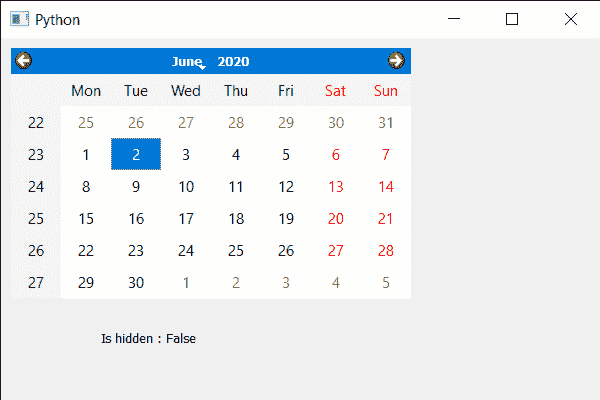

# PyQt5 QCalendarWidget–显示它

> 原文:[https://www . geeksforgeeks . org/pyqt 5-qcalendarwidget-showing-it/](https://www.geeksforgeeks.org/pyqt5-qcalendarwidget-showing-it/)

在本文中，我们将看到如何在屏幕上显示 QCalendarWidget，而不管它的当前状态是隐藏的。显示 QCalendarWidget 会更改可见属性并将其设置为 true。

> 为此，我们将对 QCalendarWidget 对象使用`show`方法。
> 
> **语法:**日历. show()
> 
> **论证:**不需要论证
> 
> **返回:**返回无

下面是实现

```
# importing libraries
from PyQt5.QtWidgets import * 
from PyQt5 import QtCore, QtGui
from PyQt5.QtGui import * 
from PyQt5.QtCore import * 
import sys

class Window(QMainWindow):

    def __init__(self):
        super().__init__()

        # setting title
        self.setWindowTitle("Python ")

        # setting geometry
        self.setGeometry(100, 100, 600, 400)

        # calling method
        self.UiComponents()

        # showing all the widgets
        self.show()

    # method for components
    def UiComponents(self):

        # creating a QCalendarWidget object
        calender = QCalendarWidget(self)

        # setting geometry to the calender
        calender.setGeometry(10, 10, 400, 250)

        # making hidden property to true
        calender.setHidden(True)

        # showing this calendar
        calender.show()

        # creating label
        label = QLabel(self)

        # setting geometry to the label
        label.setGeometry(100, 270, 250, 60)

        # making label multi line
        label.setWordWrap(True)

        # getting hidden property
        value = calender.isHidden()

        # setting text to the label
        label.setText("Is hidden : " + str(value))

# create pyqt5 app
App = QApplication(sys.argv)

# create the instance of our Window
window = Window()

# start the app
sys.exit(App.exec())
```

**输出:**
