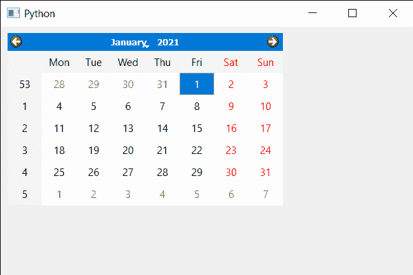

# PyQt5 QCalendarWidget–更新

> 原文:[https://www . geeksforgeeks . org/pyqt 5-qcalendarwidget-updating-it/](https://www.geeksforgeeks.org/pyqt5-qcalendarwidget-updating-it/)

在本文中，我们将看到如何更新 QCalendarWidget。更新意味着反映屏幕后端发生的任何变化。如果被禁用，更新将不起作用。

> 为此，我们将对 QCalendarWidget 对象使用`update`方法。
> 
> **语法:** calendar.update()
> 
> **论证:**不需要论证
> 
> **返回:**返回无

下面是实现

```py
# importing libraries
from PyQt5.QtWidgets import * 
from PyQt5 import QtCore, QtGui
from PyQt5.QtGui import * 
from PyQt5.QtCore import * 
import sys

class Window(QMainWindow):

    def __init__(self):
        super().__init__()

        # setting title
        self.setWindowTitle("Python ")

        # setting geometry
        self.setGeometry(100, 100, 600, 400)

        # calling method
        self.UiComponents()

        # showing all the widgets
        self.show()

    # method for components
    def UiComponents(self):

        # creating a QCalendarWidget object
        calender = QCalendarWidget(self)

        # setting geometry to the calender
        calender.setGeometry(10, 10, 400, 250)

        # setting selected date
        calender.setSelectedDate(QDate(2021, 1, 1))

        # updating the calendar
        calender.update()

# create pyqt5 app
App = QApplication(sys.argv)

# create the instance of our Window
window = Window()

# start the app
sys.exit(App.exec())
```

**输出:**
