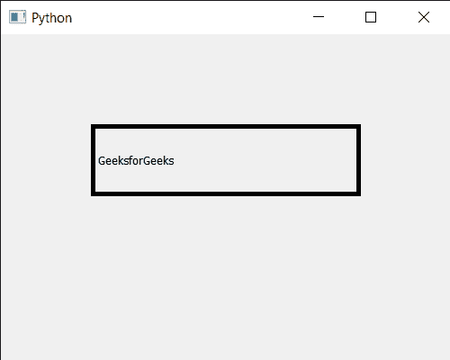

# PyQt5 qcolor dialog–完成信号

> 原文:[https://www . geeksforgeeks . org/pyqt 5-qcolor dialog-finished-signal/](https://www.geeksforgeeks.org/pyqt5-qcolordialog-finished-signal/)

在本文中，我们将看到如何获得 QColorDialog 小部件的最终信号。当用户或通过调用`done()`、`accept()`或`reject()`设置了对话框的结果代码时，会发出此信号。

**注意:**用 hide()或 setVisible()隐藏对话框时不发出此信号(false)。这包括在对话框可见时将其删除。

为了做到这一点，我们对 QColorDialog 对象使用`finished`方法

> **语法:**对话框.完成.连接(λ:打印(“完成信号”)
> 
> **自变量:**以方法为自变量
> 
> **执行的动作:**当发出结束信号时，它将调用传递的方法

下面是实现

```
# importing libraries
from PyQt5.QtWidgets import *
from PyQt5 import QtCore, QtGui
from PyQt5.QtGui import *
from PyQt5.QtCore import * import sys

class Window(QMainWindow):

    def __init__(self):
        super().__init__()

        # setting title
        self.setWindowTitle("Python ")

        # setting geometry
        self.setGeometry(100, 100, 500, 400)

        # calling method
        self.UiComponents()

        # showing all the widgets
        self.show()

    # method for components
    def UiComponents(self):

        # creating a QColorDialog object
        dialog = QColorDialog(self)

        # getting finished signal
        # printing message when signal recieved
        dialog.finished.connect(lambda: print("Finieshed Signal Emitted"))

        # executing the dialog
        dialog.exec_()

        # creating label
        label = QLabel("GeeksforGeeks", self)

        # setting geometry to the label
        label.setGeometry(100, 100, 300, 80)

        # making label multi line
        label.setWordWrap(True)

        # setting stylesheet of the label
        label.setStyleSheet("QLabel"
                            "{"
                            "border : 5px solid black;"
                            "}")

        color = Qt.black

        # setting graphic effect to the label
        graphic = QGraphicsColorizeEffect(self)

        # setting color to the graphic
        graphic.setColor(color)

        # setting graphic to the label
        label.setGraphicsEffect(graphic)

# create pyqt5 app
App = QApplication(sys.argv)

# create the instance of our Window
window = Window()

# start the app
sys.exit(App.exec())
```

**输出:**

<video class="wp-video-shortcode" id="video-435985-1" width="640" height="516" preload="metadata" controls=""><source type="video/mp4" src="https://media.geeksforgeeks.org/wp-content/uploads/20200620022458/Select-Color-2020-06-20-02-24-36.mp4?_=1">[https://media.geeksforgeeks.org/wp-content/uploads/20200620022458/Select-Color-2020-06-20-02-24-36.mp4](https://media.geeksforgeeks.org/wp-content/uploads/20200620022458/Select-Color-2020-06-20-02-24-36.mp4)</video>

```
Finieshed Signal Emitted
```

