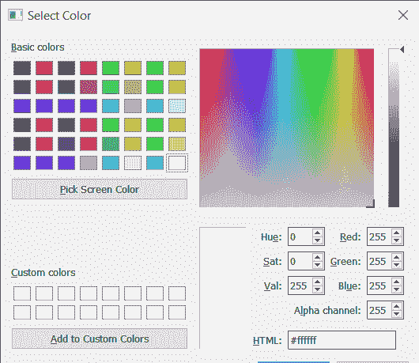
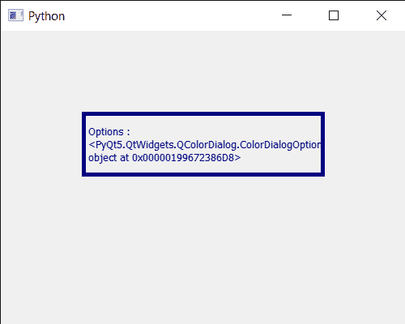

# PyQt5 qcolor Dialog–获取颜色对话框选项

> 原文:[https://www . geeksforgeeks . org/pyqt5-qcolor dialog-get-color-dialog-options/](https://www.geeksforgeeks.org/pyqt5-qcolordialog-getting-color-dialog-options/)

在本文中，我们将看到如何获得 QColorDialog 小部件的选项。基本上有三个对话框选项可用于 QColorDialog 小部件，下面是选项–

1.**显示 alpha 通道:**允许用户选择颜色的 alpha 分量
2。**按钮:**不显示确定和取消按钮
3。 **DontUseNativeDialog :** 使用 Qt 的标准颜色对话框，而不是操作系统原生颜色对话框

我们使用`setOption`方法来设置 QColorDialog 小部件的选项。

为了做到这一点，我们对 QColorDialog 对象使用`options`方法

> **语法:**对话框.选项()
> 
> **论证:**不需要论证
> 
> **返回:**返回 QColorDialog 的选项对象

下面是实现

```
# importing libraries
from PyQt5.QtWidgets import * 
from PyQt5 import QtCore, QtGui
from PyQt5.QtGui import * 
from PyQt5.QtCore import * 
import sys

class Window(QMainWindow):

    def __init__(self):
        super().__init__()

        # setting title
        self.setWindowTitle("Python ")

        # setting geometry
        self.setGeometry(100, 100, 500, 400)

        # calling method
        self.UiComponents()

        # showing all the widgets
        self.show()

    # method for components
    def UiComponents(self):

        # creating a QColorDialog object
        dialog = QColorDialog(self)

        # setting option
        dialog.setOption(QColorDialog.ShowAlphaChannel)

        # executing the dialog
        dialog.exec_()

        # creating label to display the color
        label = QLabel("GfG", self)

        # setting geometry to the label
        label.setGeometry(100, 100, 300, 80)

        # making label multi line
        label.setWordWrap(True)

        # setting stylesheet of the label
        label.setStyleSheet("QLabel"
                            "{"
                            "border : 5px solid black;"
                            "}")

        color = Qt.darkBlue

        # setting graphic effect to the label
        graphic = QGraphicsColorizeEffect(self)

        # setting color to the graphic
        graphic.setColor(color)

        # setting graphic to the label
        label.setGraphicsEffect(graphic)

        # getting the option of color dialog
        option = dialog.options()

        # setting text to the label
        label.setText("Options : " + str(option))

# create pyqt5 app
App = QApplication(sys.argv)

# create the instance of our Window
window = Window()

# start the app
sys.exit(App.exec())
```

**输出:**

