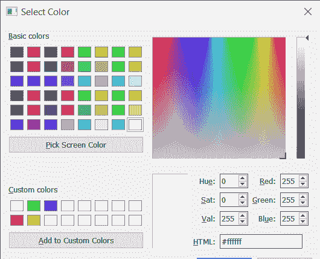
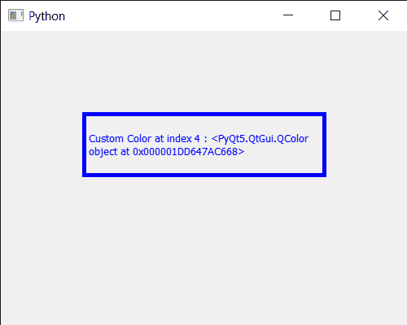

# PyQt5 qcolor dialog–获取自定义颜色

> 原文:[https://www . geeksforgeeks . org/pyqt5-qcolor dialog-get-custom-color/](https://www.geeksforgeeks.org/pyqt5-qcolordialog-getting-custom-color/)

在本文中，我们将看到如何获得 QColorDialog 小部件的自定义颜色。自定义颜色由用户制作的颜色，可以在运行时通过鼠标的帮助进行设置虽然我们可以通过`setCustomColor`方法以编程方式添加自定义颜色，但默认情况下所有自定义颜色都是白色的。下面是颜色对话框中自定义颜色的外观


为了做到这一点，我们对 QColorDialog 对象使用`customColor`方法

> **语法:**对话框. setCustomColor(i，Color)
> 
> **自变量:**以整数即索引为自变量
> 
> **返回:**返回 QColor 对象

下面是实现

```
# importing libraries
from PyQt5.QtWidgets import * 
from PyQt5 import QtCore, QtGui
from PyQt5.QtGui import * 
from PyQt5.QtCore import * 
import sys

class Window(QMainWindow):

    def __init__(self):
        super().__init__()

        # setting title
        self.setWindowTitle("Python ")

        # setting geometry
        self.setGeometry(100, 100, 500, 400)

        # calling method
        self.UiComponents()

        # showing all the widgets
        self.show()

    # method for components
    def UiComponents(self):

        # creating a QColorDialog object
        dialog = QColorDialog(self)

        # setting custom colors
        dialog.setCustomColor(1, Qt.red)
        dialog.setCustomColor(2, Qt.green)
        dialog.setCustomColor(3, Qt.yellow)
        dialog.setCustomColor(4, Qt.blue)

        # executing the dialog
        dialog.exec_()

        # creating label
        label = QLabel("GeeksforGeeks", self)

        # setting geometry to the label
        label.setGeometry(100, 100, 300, 80)

        # making label multi line
        label.setWordWrap(True)

        # setting stylesheet of the label
        label.setStyleSheet("QLabel"
                            "{"
                            "border : 5px solid black;"
                            "}")

        # getting the custom color
        color = dialog.customColor(4)

        # setting graphic effect to the label
        graphic = QGraphicsColorizeEffect(self)

        # setting color to the graphic
        graphic.setColor(color)

        # setting graphic to the label
        label.setGraphicsEffect(graphic)

        # setting text to the label
        label.setText("Custom Color at index 4 : " + str(color))

# create pyqt5 app
App = QApplication(sys.argv)

# create the instance of our Window
window = Window()

# start the app
sys.exit(App.exec())
```

**输出:**


