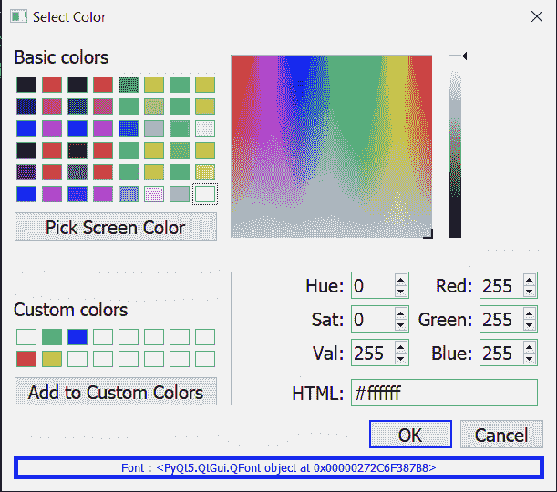

# pyqt 5q color dialog–抛掷字体

> 原文:[https://www . geeksforgeeks . org/pyqt 5-qcolor dialog-get-font/](https://www.geeksforgeeks.org/pyqt5-qcolordialog-getting-font/)

在本文中，我们将看到如何获得 QColorDialog 的字体。字体是颜色对话框中文本的样式，即属性。我们使用`setFont`方法为对话框设置字体。

**注意:**虽然对话框大小是固定的，但是增加字体大小会增加对话框的大小

为了做到这一点，我们对 QColorDialog 对象使用`font`方法

> **语法:** dialog.font()
> 
> **论证:**不需要论证
> 
> **返回:**返回 QFont 对象

下面是实现

```
# importing libraries
from PyQt5.QtWidgets import * 
from PyQt5 import QtCore, QtGui
from PyQt5.QtGui import * 
from PyQt5.QtCore import * 
import sys

class Window(QMainWindow):

    def __init__(self):
        super().__init__()

        # setting title
        self.setWindowTitle("Python ")

        # setting geometry
        self.setGeometry(100, 100, 500, 400)

        # calling method
        self.UiComponents()

        # showing all the widgets
        self.show()

    # method for components
    def UiComponents(self):

        # creating a QColorDialog object
        dialog = QColorDialog(self)

        # setting custom colors
        dialog.setCustomColor(1, Qt.red)
        dialog.setCustomColor(2, Qt.green)
        dialog.setCustomColor(3, Qt.yellow)
        dialog.setCustomColor(4, Qt.blue)

        # font
        font = QFont('Times', 12)

        # setting font to the dialog
        dialog.setFont(font)

        # creating label
        label = QLabel("Geeks for Geeks", self)

        label.setAlignment(Qt.AlignCenter)

        # making label multi line
        label.setWordWrap(True)

        # setting stylesheet of the label
        label.setStyleSheet("QLabel"
                            "{"
                            "border : 5px solid black;"
                            "}")

        # getting the custom color
        color = dialog.customColor(4)

        # setting graphic effect to the label
        graphic = QGraphicsColorizeEffect(self)

        # setting color to the graphic
        graphic.setColor(color)

        # setting graphic to the label
        label.setGraphicsEffect(graphic)

        layout = dialog.layout()

        layout.addWidget(label)

        dialog.setLayout(layout)

        # getting font
        value = dialog.font()

        # setting text to the label
        label.setText("Font : " + str(value))

        dialog.exec_()

        self.deleteLater()

# create pyqt5 app
App = QApplication(sys.argv)

# create the instance of our Window
window = Window()

# start the app
sys.exit(App.exec())
```

**输出:**
