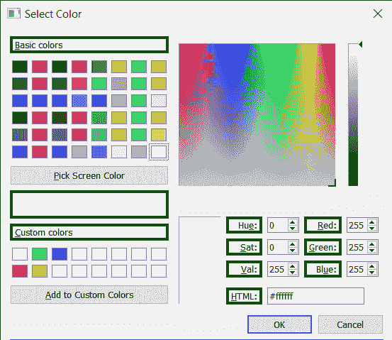

# PyQt5 qcolor dialog–为其中的子标签设置边框

> 原文:[https://www . geeksforgeeks . org/pyqt5-qcolor dialog-设置-边框到孩子-标签-呈现-在里面/](https://www.geeksforgeeks.org/pyqt5-qcolordialog-setting-border-to-the-child-labels-present-inside-it/)

在本文中，我们将看到如何设置 QColorDialog 标签的边框，即子标签。QColorDialog 是 PyQt5 中用于选择和创建颜色的弹出式类型小部件。颜色对话框是一个巨大的小部件，由许多子部件组成，因此很难为颜色对话框设置样式表，因为它是一个复杂的小部件，下面是 QColorDialog 小部件标签的边框外观



为了做到这一点，我们必须借助 set 样式表方法将样式表设置为 QColorDialog 对象，下面是样式表代码

```
QColorDialog QLabel
{
border : 2px solid blue;
}
```

下面是实现

## 蟒蛇 3

```
# importing libraries
from PyQt5.QtWidgets import *
from PyQt5 import QtCore, QtGui
from PyQt5.QtGui import *
from PyQt5.QtCore import *
import sys

class Window(QMainWindow):

    def __init__(self):
        super().__init__()

        # setting title
        self.setWindowTitle("Python ")

        # setting geometry
        self.setGeometry(100, 100, 500, 400)

        # calling method
        self.UiComponents()

        # showing all the widgets
        self.show()

    # method for components
    def UiComponents(self):

        # creating a QColorDialog object
        dialog = QColorDialog(self)

        # setting custom colors
        dialog.setCustomColor(1, Qt.red)
        dialog.setCustomColor(2, Qt.green)
        dialog.setCustomColor(3, Qt.yellow)
        dialog.setCustomColor(4, Qt.blue)

        # creating label
        label = QLabel("Geeks for Geeks", self)

        label.setAlignment(Qt.AlignCenter)

        # making label multi line
        label.setWordWrap(True)

        # setting stylesheet of the label
        label.setStyleSheet("QLabel"
                            "{"
                            "border : 5px solid black;"
                            "}")

        # getting the custom color
        color = dialog.customColor(4)

        # setting graphic effect to the label
        graphic = QGraphicsColorizeEffect(self)

        # setting color to the graphic
        graphic.setColor(color)

        # setting graphic to the label
        label.setGraphicsEffect(graphic)

        # adding label to the color dialog
        layout = dialog.layout()
        layout.addWidget(label)
        dialog.setLayout(layout)

        # setting style sheet to the color dialog's labels
        # adding border
        dialog.setStyleSheet("QColorDialog QLabel"
                             "{"
                             "border : 4px solid darkgreen;"
                             "}")

        # executing the color dialog
        dialog.exec_()

        # deleting the main window
        self.deleteLater()

# create pyqt5 app
App = QApplication(sys.argv)

# create the instance of our Window
window = Window()

# start the app
sys.exit(App.exec())
```

**输出:**

<video class="wp-video-shortcode" id="video-438240-1" width="640" height="360" preload="metadata" controls=""><source type="video/mp4" src="https://media.geeksforgeeks.org/wp-content/uploads/20200624003459/Select-Color-2020-06-24-00-34-36.mp4?_=1">[https://media.geeksforgeeks.org/wp-content/uploads/20200624003459/Select-Color-2020-06-24-00-34-36.mp4](https://media.geeksforgeeks.org/wp-content/uploads/20200624003459/Select-Color-2020-06-24-00-34-36.mp4)</video>