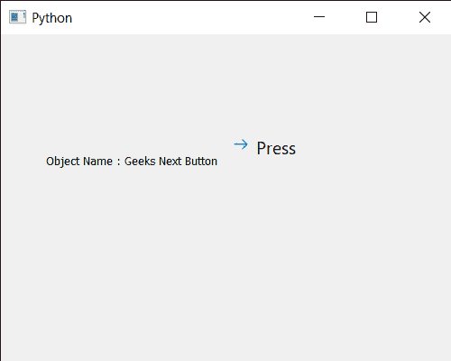

# PyQt5 qcommandlink 按钮–访问对象名称

> 原文:[https://www . geesforgeks . org/pyqt5-qcommandlink button-access-object-name/](https://www.geeksforgeeks.org/pyqt5-qcommandlinkbutton-accessing-object-name/)

在本文中，我们将看到如何获取 QCommandLinkButton 的对象名。对象名用于以编程方式搜索窗口中的特定按钮，对象名也可用于使用对象名设置样式表。默认情况下，开发人员没有为命令链接设置任何对象名称，尽管我们可以借助`setObjectName`方法随时设置它。

为此，我们对命令链接按钮对象使用`objectName`方法

> **语法:**按钮. objectName()
> 
> **论证:**不需要论证
> 
> **返回:**返回字符串

下面是实现

```
# importing libraries
from PyQt5.QtWidgets import * 
from PyQt5 import QtCore, QtGui
from PyQt5.QtGui import * 
from PyQt5.QtCore import * 
import sys

class Window(QMainWindow):

    def __init__(self):
        super().__init__()

        # setting title
        self.setWindowTitle("Python ")

        # setting geometry
        self.setGeometry(100, 100, 500, 400)

        # calling method
        self.UiComponents()

        # showing all the widgets
        self.show()

    # method for components
    def UiComponents(self):

        # creating a command link button
        cl_button = QCommandLinkButton("Press", self)

        # setting geometry
        cl_button.setGeometry(250, 100, 200, 50)

        # setting object name
        cl_button.setObjectName("Geeks Next Button")

        # creating label
        label = QLabel("GeeksforGeeks", self)

        # setting label geometry
        label.setGeometry(50, 100, 200, 80)

        # making label multiline
        label.setWordWrap(True)

        # getting object name
        value = cl_button.objectName()

        # setting text to the label
        label.setText("Object Name : " + str(value))

# create pyqt5 app
App = QApplication(sys.argv)

# create the instance of our Window
window = Window()

# start the app
sys.exit(App.exec())
```

**输出:**
