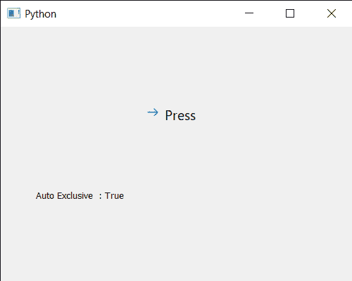

# PyQt5 qcommandlink button–获取自动专属属性

> 原文:[https://www . geesforgeks . org/pyqt5-qcommandlink button-get-auto-exclusive-property/](https://www.geeksforgeeks.org/pyqt5-qcommandlinkbutton-getting-auto-exclusive-property/)

在本文中，我们将看到如何获得 QCommandLinkButton 的自动独占属性。如果启用了自动独占，则属于同一父小部件的可检查命令链接按钮的行为就像它们是同一独占按钮组的一部分一样。在独占命令链接按钮组中，任何时候只能选中一个按钮；选中另一个按钮会自动取消选中先前选中的按钮。属性对属于按钮组的按钮没有影响。我们可以借助`setAutoExclusive`方法来证明这个性质。

为此，我们对命令链接按钮对象使用`autoExclusive`方法

> **语法:**按钮. autoExclusive()
> 
> **论证:**不需要论证
> 
> **返回:**返回 bool

下面是实现

```
# importing libraries
from PyQt5.QtWidgets import * 
from PyQt5 import QtCore, QtGui
from PyQt5.QtGui import * 
from PyQt5.QtCore import * 
import sys

class Window(QMainWindow):

    def __init__(self):
        super().__init__()

        # setting title
        self.setWindowTitle("Python ")

        # setting geometry
        self.setGeometry(100, 100, 500, 400)

        # calling method
        self.UiComponents()

        # showing all the widgets
        self.show()

    # method for components
    def UiComponents(self):

        # creating a command link button
        cl_button = QCommandLinkButton("Press", self)

        # setting geometry
        cl_button.setGeometry(200, 100, 150, 60)

        # making button checkable
        cl_button.setCheckable(True)

        # making it auto exclusive
        cl_button.setAutoExclusive(True)

        # creating label
        label = QLabel("GeeksforGeeks", self)

        # setting label geometry
        label.setGeometry(50, 200, 300, 80)

        # making label multiline
        label.setWordWrap(True)

        # getting auto exclusive property
        value = cl_button.autoExclusive()

        # setting text to the label
        label.setText("Auto Exclusive  : " + str(value))

# create pyqt5 app
App = QApplication(sys.argv)

# create the instance of our Window
window = Window()

# start the app
sys.exit(App.exec())
```

**输出:**
