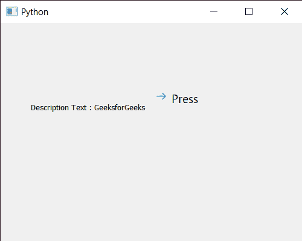

# PyQt5 qcommandlink 按钮–获取描述文本

> 原文:[https://www . geesforgeks . org/pyqt5-qcommandlink button-get-description-text/](https://www.geeksforgeeks.org/pyqt5-qcommandlinkbutton-getting-description-text/)

在本文中，我们将看到如何获取 QCommandLinkButton 的描述文本。描述文本属性包含一个描述性标签来补充命令链接按钮文本。设置此属性将在按钮上设置描述性文本，作为文本标签的补充。这通常会以小于主要文本的字体显示。可以借助`setDescription`方法添加。

为此，我们对命令链接按钮对象使用`description`方法

> **语法:**按钮.描述()
> 
> **论证:**不需要论证
> 
> **返回:**返回字符串

下面是实现

```
# importing libraries
from PyQt5.QtWidgets import * 
from PyQt5 import QtCore, QtGui
from PyQt5.QtGui import * 
from PyQt5.QtCore import * 
import sys

class Window(QMainWindow):

    def __init__(self):
        super().__init__()

        # setting title
        self.setWindowTitle("Python ")

        # setting geometry
        self.setGeometry(100, 100, 500, 400)

        # calling method
        self.UiComponents()

        # showing all the widgets
        self.show()

    # method for components
    def UiComponents(self):

        # creating a command link button
        cl_button = QCommandLinkButton("Press", self)

        # setting geometry
        cl_button.setGeometry(250, 100, 200, 50)

        # text
        text = "GeeksforGeeks"

        # setting description text
        cl_button.setDescription(text)

        # creating label
        label = QLabel("GeeksforGeeks", self)

        # setting label geometry
        label.setGeometry(50, 100, 200, 80)

        # making label multiline
        label.setWordWrap(True)

        # getting description text
        value = cl_button.description()

        # setting text to the label
        label.setText("Description Text : " + str(value))

# create pyqt5 app
App = QApplication(sys.argv)

# create the instance of our Window
window = Window()

# start the app
sys.exit(App.exec())
```

**输出:**
