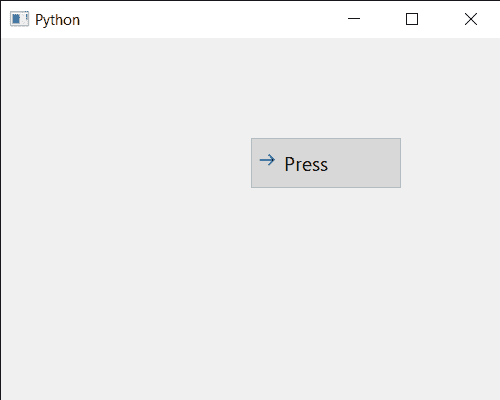

# PyQt5 qcommandlink 按钮–如何设置检查状态

> 原文:[https://www . geeksforgeeks . org/pyqt 5-qcommandlink button-如何设置检查状态/](https://www.geeksforgeeks.org/pyqt5-qcommandlinkbutton-how-to-set-check-state/)

在本文中，我们将看到如何使可检查的 QCommandLinkButton 被选中或取消选中，默认情况下它是不可检查的，尽管我们可以借助`setCheckable`方法使其随时可检查。此外，当它是可检查的时，它的状态是未检查的，尽管我们可以通过编程来检查它的状态。

为此，我们对命令链接按钮对象使用`setChecked`方法

> **语法:**按钮。设置选中(真)
> 
> **自变量:**它以布尔为自变量
> 
> **返回:**返回无

下面是实现

```
# importing libraries
from PyQt5.QtWidgets import * 
from PyQt5 import QtCore, QtGui
from PyQt5.QtGui import *
from PyQt5.QtCore import * 
import sys

class Window(QMainWindow):

    def __init__(self):
        super().__init__()

        # setting title
        self.setWindowTitle("Python ")

        # setting geometry
        self.setGeometry(100, 100, 500, 400)

        # calling method
        self.UiComponents()

        # showing all the widgets
        self.show()

    # method for components
    def UiComponents(self):

        # creating a command link button
        cl_button = QCommandLinkButton("Press", self)

        # setting geometry
        cl_button.setGeometry(250, 100, 150, 50)

        # making it checkable
        cl_button.setCheckable(True)

        # making its state checked
        cl_button.setChecked(True)

# create pyqt5 app
App = QApplication(sys.argv)

# create the instance of our Window
window = Window()

# start the app
sys.exit(App.exec())
```

**输出:**
