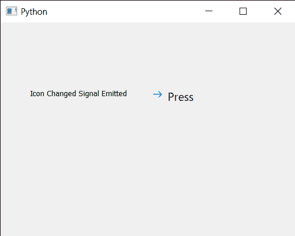

# PYqt5 Qcommand link button–图标更改信号

> 原文:[https://www . geesforgeks . org/pyqt 5-qcommandlink button-icon-changed-signal/](https://www.geeksforgeeks.org/pyqt5-qcommandlinkbutton-icon-changed-signal/)

在本文中，我们将看到如何获得 QCommandLinkButton 的图标更改信号。当命令链接按钮的图标发生变化时，会发出此信号。默认情况下，一个箭头被设置为命令链接按钮的图标，尽管我们可以在`setIcon`方法的帮助下随时更改它。

为此，我们对命令链接按钮对象使用`windowIconChanged`方法

> **语法:**button . windowiconchanded . connect(方法)
> 
> **自变量:**以方法为自变量
> 
> **执行的动作:**发出点击信号时调用方法

下面是实现

```py
# importing libraries
from PyQt5.QtWidgets import * 
from PyQt5 import QtCore, QtGui
from PyQt5.QtGui import * 
from PyQt5.QtCore import * 
import sys

class Window(QMainWindow):

    def __init__(self):
        super().__init__()

        # setting title
        self.setWindowTitle("Python ")

        # setting geometry
        self.setGeometry(100, 100, 500, 400)

        # calling method
        self.UiComponents()

        # showing all the widgets
        self.show()

    # method for components
    def UiComponents(self):

        # creating a command link button
        cl_button = QCommandLinkButton("Press", self)

        # setting geometry
        cl_button.setGeometry(250, 100, 150, 60)

        # creating label
        label = QLabel(self)

        # setting label geometry
        label.setGeometry(50, 100, 200, 40)

        # making label multiline
        label.setWordWrap(True)

        # making it checkable
        cl_button.setCheckable(True)

        # text
        text = "Icon Changed Signal Emitted"

        # icon changed signal
        cl_button.windowIconChanged.connect(lambda: label.setText(text))

        # icon
        icon = QIcon('logo.png')

        # changing icon
        cl_button.setWindowIcon(icon)

# create pyqt5 app
App = QApplication(sys.argv)

# create the instance of our Window
window = Window()

# start the app
sys.exit(App.exec())
```

**输出:**
