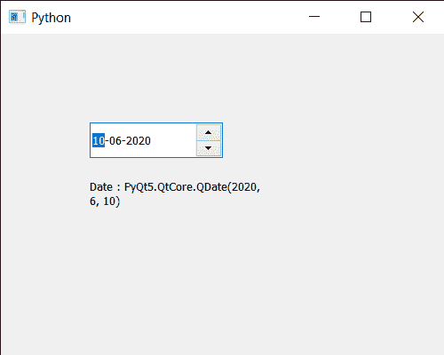

# pyqt 5 qdateedit–输入日期

> 原文:[https://www . geesforgeks . org/pyqt 5-qdate edit-get-input-date/](https://www.geeksforgeeks.org/pyqt5-qdateedit-getting-input-date/)

在本文中，我们将看到如何获得 QDateEdit 的输入日期。用户可以在光标和键盘的帮助下为日期编辑设置日期，但有时需要通过编程设置初始日期或日期来显示记录中的日期，这可以在 set date 方法的帮助下完成。
为了做到这一点，我们使用日期方法和 QDateEdit 对象

> **语法:**date . date()
> T3】参数:不需要参数
> **返回:**返回 QDate 对象

下面是实现

## 蟒蛇 3

```
# importing libraries
from PyQt5.QtWidgets import *
from PyQt5 import QtCore, QtGui
from PyQt5.QtGui import *
from PyQt5.QtCore import *
import sys

class Window(QMainWindow):

    def __init__(self):
        super().__init__()

        # setting title
        self.setWindowTitle("Python ")

        # setting geometry
        self.setGeometry(100, 100, 500, 400)

        # calling method
        self.UiComponents()

        # showing all the widgets
        self.show()

    # method for components
    def UiComponents(self):

        # creating a QDateEdit widget
        date = QDateEdit(self)

        # setting geometry of the date edit
        date.setGeometry(100, 100, 150, 40)

        # date
        d = QDate(2020, 6, 10)

        # setting date to the date edit
        date.setDate(d)

        # creating a label
        label = QLabel("GeeksforGeeks", self)

        # setting geometry
        label.setGeometry(100, 150, 200, 60)

        # making label multiline
        label.setWordWrap(True)

        # getting current date
        value = date.date()

        # setting text to the label
        label.setText("Date : " + str(value))

# create pyqt5 app
App = QApplication(sys.argv)

# create the instance of our Window
window = Window()

# start the app
sys.exit(App.exec())
```

**输出:**

