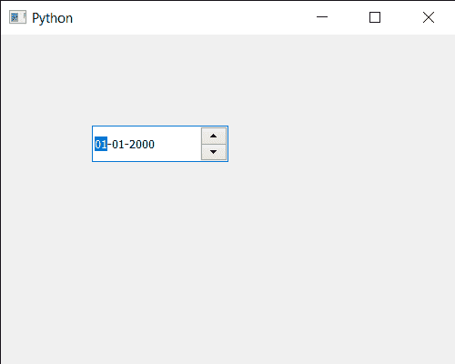

# PyQt5 QDateedit–设置时间

> 原文:[https://www.geeksforgeeks.org/pyqt5-qdateedit-setting-time/](https://www.geeksforgeeks.org/pyqt5-qdateedit-setting-time/)

在本文中，我们将看到如何将时间设置为 QDateEdit。与普通的类似日期不同，我们可以借助`setDate`方法为其设置日期时间。但是我们也可以只设定时间而不改变日期。

为了做到这一点，我们对 QDateEdit 对象使用`setTime`方法

> **语法:**日期.设置时间(时间)
> 
> **自变量:**它以 QTime 对象为自变量
> 
> **返回:**返回无

下面是实现

```py
# importing libraries
from PyQt5.QtWidgets import * 
from PyQt5 import QtCore, QtGui
from PyQt5.QtGui import * 
from PyQt5.QtCore import * 
import sys

class Window(QMainWindow):

    def __init__(self):
        super().__init__()

        # setting title
        self.setWindowTitle("Python ")

        # setting geometry
        self.setGeometry(100, 100, 500, 400)

        # calling method
        self.UiComponents()

        # showing all the widgets
        self.show()

    # method for components
    def UiComponents(self):

        # creating a QDateEdit widget
        date = QDateEdit(self)

        # setting geometry of the date edit
        date.setGeometry(100, 100, 150, 40)

        # date time
        time = QTime(11, 30, 0)

        # setting time
        date.setTime(time)

# create pyqt5 app
App = QApplication(sys.argv)

# create the instance of our Window
window = Window()

# start the app
sys.exit(App.exec())
```

**输出:**
