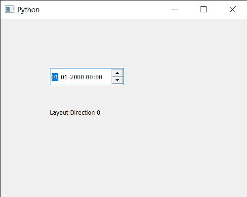

# PYqt 5 QDateTimeedit–清除布局方向属性

> 原文:[https://www . geesforgeks . org/pyqt 5-qdatetime edit-clearing-layout-direction-property/](https://www.geeksforgeeks.org/pyqt5-qdatetimeedit-clearing-layout-direction-property/)

在本文中，我们将看到如何移除/清除 QDateTimeEdit 小部件的选定布局方向。清除布局方向会将布局方向恢复为默认方向。布局方向指定日期时间的方向，默认情况下，增加或减少日期时间的箭头按钮位于右侧，尽管通过`setLayoutDirection`方法设置布局方向，它们可以出现在左侧。

为了做到这一点，我们将使用`unsetLayoutDirection`方法和 QDateTimeEdit 对象。

> **语法 ：** datetimeedit.unsetLayoutDirection（）
> 
> **论证:**不需要论证
> 
> **返回:**返回无

下面是实现

```py
# importing libraries
from PyQt5.QtWidgets import * 
from PyQt5 import QtCore, QtGui
from PyQt5.QtGui import * 
from PyQt5.QtCore import * 
import sys

class Window(QMainWindow):

    def __init__(self):
        super().__init__()

        # setting title
        self.setWindowTitle("Python ")

        # setting geometry
        self.setGeometry(100, 100, 500, 400)

        # calling method
        self.UiComponents()

        # showing all the widgets
        self.show()

    # method for components
    def UiComponents(self):

        # creating a QDateTimeEdit widget
        datetimeedit = QDateTimeEdit(self)

        # setting geometry
        datetimeedit.setGeometry(100, 100, 150, 35)

        # setting layout direction
        datetimeedit.setLayoutDirection(1)

        # clearing layout direction
        datetimeedit.unsetLayoutDirection()

        # creating a label
        label = QLabel("GeeksforGeeks", self)

        # setting geometry to the label
        label.setGeometry(100, 160, 200, 60)

        # making label multi line
        label.setWordWrap(True)

        # getting layout direction
        value = datetimeedit.layoutDirection()

        # setting text to the label
        label.setText("Layout Direction " + str(value))

# create pyqt5 app
App = QApplication(sys.argv)

# create the instance of our Window
window = Window()

# start the app
sys.exit(App.exec())
```

**输出:**
