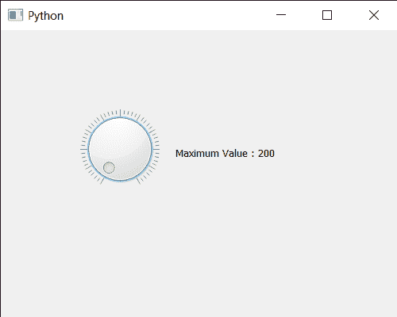

# PyQt5 QDial–获取上限

> 原文:[https://www . geeksforgeeks . org/pyqt 5-qdial-get-upper-bound/](https://www.geeksforgeeks.org/pyqt5-qdial-getting-upper-bound/)

在本文中，我们将看到如何获得 QDial 的上限。上限表示 QDial 可以处理的最高值默认情况下最大值是 99 虽然我们可以借助`setMaximum`方法随时更改。有了上限，我们就可以确定上限以上的数可以赋值。设置上限不会影响 Qdial 的移动，它仍然可以移动 360 度。

为此，我们对 QDial 对象使用`maximum`方法

> **语法:** dial.maximum()
> 
> **论证:**不需要论证
> 
> **返回:**返回整数

下面是实现

```py
# importing libraries
from PyQt5.QtWidgets import * 
from PyQt5 import QtCore, QtGui
from PyQt5.QtGui import * 
from PyQt5.QtCore import * 
import sys

class Window(QMainWindow):

    def __init__(self):
        super().__init__()

        # setting title
        self.setWindowTitle("Python ")

        # setting geometry
        self.setGeometry(100, 100, 500, 400)

        # calling method
        self.UiComponents()

        # showing all the widgets
        self.show()

    # method for components
    def UiComponents(self):

        # creating QDial object
        dial = QDial(self)

        # setting geometry to the dial
        dial.setGeometry(100, 100, 100, 100)

        # setting maximum value to the dial
        dial.setMaximum(200)

        # making notch visible
        dial.setNotchesVisible(True)

        # creating a label
        label = QLabel("GeeksforGeeks", self)

        # setting geometry to the label
        label.setGeometry(220, 125, 200, 60)

        # making label multiline
        label.setWordWrap(True)

        # adding action to the dial
        dial.valueChanged.connect(lambda: label.setText("Value = " + str(dial.value())))

        # getting maximum value
        value = dial.maximum()

        # setting text to the label
        label.setText("Maximum Value : " + str(value))

# create pyqt5 app
App = QApplication(sys.argv)

# create the instance of our Window
window = Window()

# start the app
sys.exit(App.exec())
```

**输出:**
