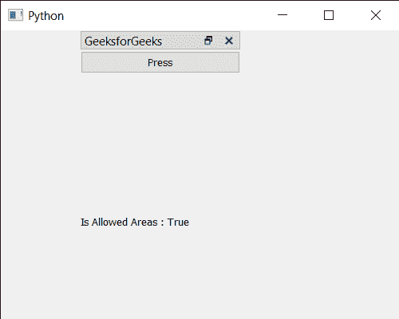

# PYqt5 QDockWidget–检查给定区域是否允许

> 原文:[https://www . geeksforgeeks . org/pyqt 5-qdock widget-checking-如果允许给定区域/](https://www.geeksforgeeks.org/pyqt5-qdockwidget-checking-if-given-area-is-allowed/)

在本文中，我们将看到如何检查给定区域是否是 QDockWidget 的允许区域。QDockWidget 提供了 DockWidget 的概念，也称为工具选项板或实用程序窗口。停靠窗口是放置在 QMainWindow(原始窗口)中央小部件周围的停靠小部件区域中的辅助窗口。Dock 可以在主窗口的任何地方移动，设置 dock widget 可以放置的允许区域，可以借助`setAllowedAreas`方法进行设置。

> 为此，我们将对 dock widget 对象使用`isAreaAllowed`方法。
> 
> **语法:**dock . isareaallied(区域)
> 
> **参数:**它以 QDockWidgetArea 对象为参数
> 
> **返回:**返回 bool

下面是实现

```
# importing libraries
from PyQt5.QtWidgets import * 
from PyQt5 import QtCore, QtGui
from PyQt5.QtGui import * 
from PyQt5.QtCore import * 
import sys

class Window(QMainWindow):

    def __init__(self):
        super().__init__()

        # setting title
        self.setWindowTitle("Python ")

        # setting geometry
        self.setGeometry(100, 100, 500, 400)

        # calling method
        self.UiComponents()

        # showing all the widgets
        self.show()

    # method for components
    def UiComponents(self):

        # creating dock widget
        dock = QDockWidget("GeeksforGeeks", self)

        # push button
        push = QPushButton("Press", self)

        # setting widget to the dock
        dock.setWidget(push)

        # creating a label
        label = QLabel("GeeksforGeeks", self)

        # setting geometry to the label
        label.setGeometry(100, 200, 300, 80)

        # making label multi line
        label.setWordWrap(True)

        # setting geometry tot he dock widget
        dock.setGeometry(100, 0, 200, 30)

        # checking if this area is  allowed areas of the dock
        value = dock.isAreaAllowed(Qt.AllDockWidgetAreas)

        # setting text to the label
        label.setText("Is Allowed Areas : " + str(value))

# create pyqt5 app
App = QApplication(sys.argv)

# create the instance of our Window
window = Window()

# start the app
sys.exit(App.exec())
```

**输出:**
