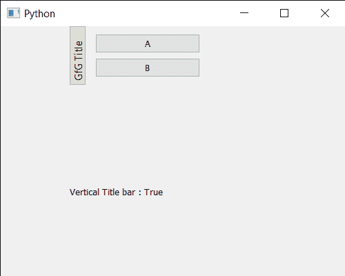

# PyQt5 qdockewidget–检查它是否有垂直标题栏

> 原文:[https://www . geeksforgeeks . org/pyqt 5-qdock widget-checking-if-it-with-vertical-title-bar/](https://www.geeksforgeeks.org/pyqt5-qdockwidget-checking-if-it-has-vertical-title-bar/)

在本文中，我们将看到如何检查 QDockWidget 的垂直标题栏。QDockWidget 提供了 DockWidget 的概念，也称为工具选项板或实用程序窗口。停靠窗口是放置在 QMainWindow(原始窗口)中央小部件周围的停靠小部件区域中的辅助窗口。默认情况下，标题栏是水平的，尽管我们可以在`dock.setFeatures(QDockWidget.DockWidgetVerticalTitleBar)`命令的帮助下随时将其垂直。

> 为此，我们将对 dock widget 对象使用`features`方法。
> 
> **语法:** dock.features()
> 
> **论证:**不需要论证
> 
> **返回:**返回用垂直特征对象检查的特征对象

下面是实现

```
# importing libraries
from PyQt5.QtWidgets import * 
from PyQt5 import QtCore, QtGui
from PyQt5.QtGui import * 
from PyQt5.QtCore import * 
import sys

class Window(QMainWindow):

    def __init__(self):
        super().__init__()

        # setting title
        self.setWindowTitle("Python ")

        # setting geometry
        self.setGeometry(100, 100, 500, 400)

        # calling method
        self.UiComponents()

        # showing all the widgets
        self.show()

    # method for components
    def UiComponents(self):

        # creating dock widget
        dock = QDockWidget(self)

        # setting title to the doc widget
        dock.setWindowTitle("GfG Title")

        # setting vertical title bar
        dock.setFeatures(QDockWidget.DockWidgetVerticalTitleBar)

        # creating a QWidget object
        widget = QWidget(self)

        # creating a vertical box layout
        layout = QVBoxLayout(self)

        # push button 1
        push1 = QPushButton("A", self)

        # push button 2
        push2 = QPushButton("B", self)

        # adding these buttons to the layout
        layout.addWidget(push1)
        layout.addWidget(push2)

        # setting the layout to the widget
        widget.setLayout(layout)

        # adding widget to the layout
        dock.setWidget(widget)

        # creating a label
        label = QLabel("GeesforGeeks", self)

        # setting geometry to the label
        label.setGeometry(100, 200, 300, 80)

        # making label multi line
        label.setWordWrap(True)

        # setting geometry tot he dock widget
        dock.setGeometry(100, 0, 200, 30)

        # getting features
        feature = dock.features()

        # checking if vertical feature
        value = feature == QDockWidget.DockWidgetVerticalTitleBar

        # setting text to the label
        label.setText("Vertical Title bar : " + str(value))

# create pyqt5 app
App = QApplication(sys.argv)

# create the instance of our Window
window = Window()

# start the app
sys.exit(App.exec())
```

**输出:**
