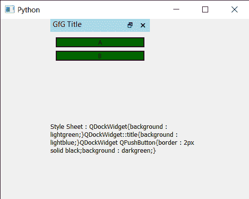

# PYqt5 QDockWidget–获取样式表

> 原文:[https://www . geeksforgeeks . org/pyqt 5-qdock widget-get-样式表/](https://www.geeksforgeeks.org/pyqt5-qdockwidget-getting-style-sheet/)

在本文中，我们将看到如何获得 QDockWidget 的样式表。QDockWidget 提供了 DockWidget 的概念，也称为工具选项板或实用程序窗口。停靠窗口是放置在 QMainWindow(原始窗口)中央小部件周围的停靠小部件区域中的辅助窗口。样式表代表小部件的样式，即外观，它由颜色、间距、填充、边框特征组成。可以借助`setStyleSheet`方法进行设置。

> 为此，我们将对 dock widget 对象使用`styleSheet`方法。
> 
> **语法:** dock .样式表()
> 
> **论证:**不需要论证
> 
> **返回:**返回字符串

下面是实现

```
# importing libraries
from PyQt5.QtWidgets import * 
from PyQt5 import QtCore, QtGui
from PyQt5.QtGui import * 
from PyQt5.QtCore import * 
import sys

class Window(QMainWindow):

    def __init__(self):
        super().__init__()

        # setting title
        self.setWindowTitle("Python ")

        # setting geometry
        self.setGeometry(100, 100, 500, 400)

        # calling method
        self.UiComponents()

        # showing all the widgets
        self.show()

    # method for components
    def UiComponents(self):

        # creating dock widget
        dock = QDockWidget(self)

        # setting title to the doc widget
        dock.setWindowTitle("GfG Title")

        # creating a QWidget object
        widget = QWidget(self)

        # creating a vertical box layout
        layout = QVBoxLayout(self)

        # push button 1
        push1 = QPushButton("A", self)

        # push button 2
        push2 = QPushButton("B", self)

        # adding these buttons to the layout
        layout.addWidget(push1)
        layout.addWidget(push2)

        # setting the layout to the widget
        widget.setLayout(layout)

        # adding widget to the layout
        dock.setWidget(widget)

        # creating a label
        label = QLabel("GeesforGeeks", self)

        # setting geometry to the label
        label.setGeometry(100, 200, 300, 80)

        # making label multi line
        label.setWordWrap(True)

        # setting geometry to the dock widget
        dock.setGeometry(100, 0, 200, 30)

        # setting style sheet to the  dock widget
        dock.setStyleSheet("QDockWidget"
                           "{"
                           "background : lightgreen;"
                           "}"
                           "QDockWidget::title"
                           "{"
                           "background : lightblue;"
                           "}"
                           "QDockWidget QPushButton"
                           "{"
                           "border : 2px solid black;"
                           "background : darkgreen;"
                           "}"
                           )

        # getting style sheet
        value = dock.styleSheet()

        # setting text to the label
        label.setText("Style Sheet : " + value)

# create pyqt5 app
App = QApplication(sys.argv)

# create the instance of our Window
window = Window()

# start the app
sys.exit(App.exec())
```

**输出:**
