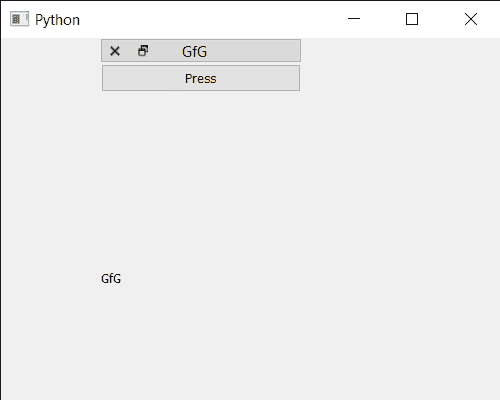

# PYqt5 QDockWidget–设置布局方向

> 原文:[https://www . geeksforgeeks . org/pyqt 5-qdock widget-设置-布局-方向/](https://www.geeksforgeeks.org/pyqt5-qdockwidget-setting-layout-direction/)

在本文中，我们将看到如何设置 QDockWidget 的布局方向。QDockWidget 提供了 DockWidget 的概念，也称为工具选项板或实用程序窗口。停靠窗口是放置在 QMainWindow(原始窗口)中央小部件周围的停靠小部件区域中的辅助窗口。布局指定如何排列孩子，通过设置布局方向我们可以指定排列的顺序。

> 为此，我们将对 dock widget 对象使用`setLayoutDirection`方法。
> 
> **语法:** dock.setLayoutDirection(直接)
> 
> **自变量:**以方向对象为自变量
> 
> **返回:**返回无

下面是实现

```
# importing libraries
from PyQt5.QtWidgets import * 
from PyQt5 import QtCore, QtGui
from PyQt5.QtGui import * 
from PyQt5.QtCore import * 
import sys

class Window(QMainWindow):

    def __init__(self):
        super().__init__()

        # setting title
        self.setWindowTitle("Python ")

        # setting geometry
        self.setGeometry(100, 100, 500, 400)

        # calling method
        self.UiComponents()

        # showing all the widgets
        self.show()

    # method for components
    def UiComponents(self):

        # creating dock widget
        dock = QDockWidget(self)

        # setting title to the doc widget
        dock.setWindowTitle("                   GfG ")

        # push button
        push = QPushButton("Press", self)

        # setting widget to the dock
        dock.setWidget(push)

        # setting layout direction
        dock.setLayoutDirection(Qt.RightToLeft)

        # creating a label
        label = QLabel("GfG", self)

        # setting geometry to the label
        label.setGeometry(100, 200, 300, 80)

        # making label multi line
        label.setWordWrap(True)

        # setting geometry tot he dock widget
        dock.setGeometry(100, 0, 200, 30)

# create pyqt5 app
App = QApplication(sys.argv)

# create the instance of our Window
window = Window()

# start the app
sys.exit(App.exec())
```

**输出:**
