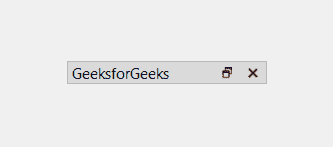
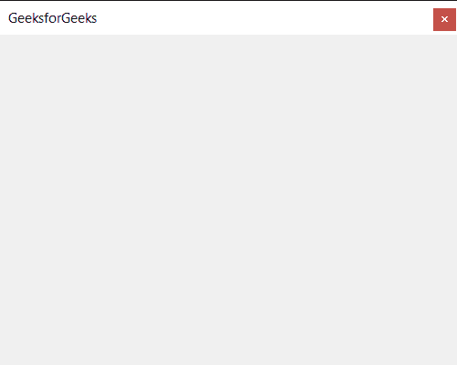

# pyqt 5–qdlock widget

> 哎哎哎:# t0]https://www . geeksforgeeks . org/pyqt 5-qdock widget/

**QDockWidget** 提供了 DockWidget 的概念，也称为工具选项板或实用程序窗口。停靠窗口是放置在 QMainWindow(原始窗口)中央小部件周围的停靠小部件区域中的辅助窗口。终端用户可以将停靠窗口移动到其当前区域内，移动到新的区域，并将其浮动(例如，取消停靠)。QDockWidget 应用编程接口允许程序员限制 DockWidget 移动、浮动和关闭的能力，以及它们可以放置的区域。
下面是 dock widget 的外观



当我们打开这个小部件时，它看起来像这样



**示例:**
我们将创建一个 dock widget，并向其中添加按钮，当按钮被按下时，标签上会打印一条消息
下面是实现方式

## 蟒蛇 3

```py
# importing libraries
from PyQt5.QtWidgets import *
from PyQt5 import QtCore, QtGui
from PyQt5.QtGui import *
from PyQt5.QtCore import *
import sys

class Window(QMainWindow):

    def __init__(self):
        super().__init__()

        # setting title
        self.setWindowTitle("Python ")

        # setting geometry
        self.setGeometry(100, 100, 500, 400)

        # calling method
        self.UiComponents()

        # showing all the widgets
        self.show()

    # method for components
    def UiComponents(self):

        # creating dock widget
        dock = QDockWidget("GeeksforGeeks", self)

        # push button
        push = QPushButton("Press", self)

        # setting widget to the dock
        dock.setWidget(push)

        # setting geometry tot he dock widget
        dock.setGeometry(100, 0, 200, 30)

        # creating a label
        label = QLabel("GeeksforGeeks", self)

        # setting geometry to the label
        label.setGeometry(100, 200, 300, 80)

        # making label multi line
        label.setWordWrap(True)

        # adding action to the push button
        push.clicked.connect(lambda: label.setText("Dock Widget's Push button pressed"))

# create pyqt5 app
App = QApplication(sys.argv)

# create the instance of our Window
window = Window()

# start the app
sys.exit(App.exec())
```

**输出:**

<video class="wp-video-shortcode" id="video-457870-1" width="640" height="360" preload="metadata" controls=""><source type="video/mp4" src="https://media.geeksforgeeks.org/wp-content/uploads/20200723015008/Python-2020-07-23-01-49-40.mp4?_=1">[https://media.geeksforgeeks.org/wp-content/uploads/20200723015008/Python-2020-07-23-01-49-40.mp4](https://media.geeksforgeeks.org/wp-content/uploads/20200723015008/Python-2020-07-23-01-49-40.mp4)</video>