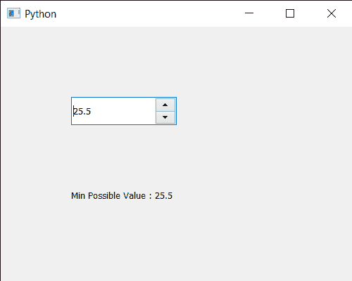

# PyQt5 QDoubleSpinBox–获取最小可能值

> 原文:[https://www . geesforgeks . org/pyqt5-qdoublespinbox-get-最小可能值/](https://www.geeksforgeeks.org/pyqt5-qdoublespinbox-getting-minimum-possible-value/)

在本文中，我们将了解如何获得 QDoubleSpinBox 的最小可能值。默认情况下，双旋转框的最小可能值为 0。即用户不能输入小于 0 的值，尽管我们可以借助`setMinimum`方法随时更改该最大值。通过更改最小值，我们允许用户输入大于最小值的值。

> 为了做到这一点，我们将使用双旋转框对象的`minimum`方法。
> 
> **语法:** dd_spin.minimum()
> 
> **论证:**不需要论证
> 
> **返回:**返回浮点值

下面是实现

```
# importing libraries
from PyQt5.QtWidgets import * 
from PyQt5 import QtCore, QtGui
from PyQt5.QtGui import * 
from PyQt5.QtCore import * 
import sys

class Window(QMainWindow):

    def __init__(self):
        super().__init__()

        # setting title
        self.setWindowTitle("Python ")

        # setting geometry
        self.setGeometry(100, 100, 500, 400)

        # calling method
        self.UiComponents()

        # showing all the widgets
        self.show()

    # method for components
    def UiComponents(self):

        # creating double spin box
        d_spin = QDoubleSpinBox(self)

        # setting geometry to the double spin box
        d_spin.setGeometry(100, 100, 150, 40)

        # setting decimal precision
        d_spin.setDecimals(1)

        # step type
        step_type = QAbstractSpinBox.AdaptiveDecimalStepType

        # adaptive step type
        d_spin.setStepType(step_type)

        # setting minimum value
        d_spin.setMinimum(25.5)

        # creating a label
        label = QLabel("GeeksforGeeks", self)

        # setting geometry to the label
        label.setGeometry(100, 200, 300, 80)

        # making label multi line
        label.setWordWrap(True)

        # getting minimum value
        value = d_spin.minimum()

        # setting text to the label
        label.setText("Min Possible Value : " + str(value))

# create pyqt5 app
App = QApplication(sys.argv)

# create the instance of our Window
window = Window()

# start the app
sys.exit(App.exec())
```

**输出:**
