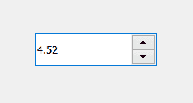

# pyqt 5–qdubles box

> 哎哎哎::1230【https://www . geeksforgeeks . org/pyqt 5-qdouble ball box/

QDoubleSpinBox 允许用户通过单击向上和向下按钮或按键盘上的向上或向下按钮来增加或减少当前显示的值来选择值。用户也可以手动输入该值。微调框支持双精度值，但可以扩展为使用不同的字符串。下面是双旋转框的外观



**示例:**
一个具有双旋转框和标签的窗口，当值发生变化时，显示当前值的标签中将出现一条消息。

下面是实现

```py
# importing libraries
from PyQt5.QtWidgets import * 
from PyQt5 import QtCore, QtGui
from PyQt5.QtGui import * 
from PyQt5.QtCore import * 
import sys

class Window(QMainWindow):

    def __init__(self):
        super().__init__()

        # setting title
        self.setWindowTitle("Python ")

        # setting geometry
        self.setGeometry(100, 100, 500, 400)

        # calling method
        self.UiComponents()

        # showing all the widgets
        self.show()

    # method for components
    def UiComponents(self):

        # creating double spin box
        d_spin = QDoubleSpinBox(self)

        # setting geometry to the double spin box
        d_spin.setGeometry(100, 100, 150, 40)

        # adding action to the double spin box
        d_spin.valueChanged.connect(lambda:  spin_method())

        # creating a label
        label = QLabel("GeeksforGeeks", self)

        # setting geometry to the label
        label.setGeometry(100, 200, 300, 80)

        # making label multi line
        label.setWordWrap(True)

        def spin_method():

            # getting current value of double spin box
            value = d_spin.value()

            # setting text to the label
            label.setText("Current Value : " + str(value))

# create pyqt5 app
App = QApplication(sys.argv)

# create the instance of our Window
window = Window()

# start the app
sys.exit(App.exec())
```

**输出:**

<video class="wp-video-shortcode" id="video-451440-1" width="640" height="512" preload="metadata" controls=""><source type="video/mp4" src="https://media.geeksforgeeks.org/wp-content/uploads/20200713010528/Python-2020-07-13-01-05-01.mp4?_=1">[https://media.geeksforgeeks.org/wp-content/uploads/20200713010528/Python-2020-07-13-01-05-01.mp4](https://media.geeksforgeeks.org/wp-content/uploads/20200713010528/Python-2020-07-13-01-05-01.mp4)</video>