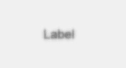
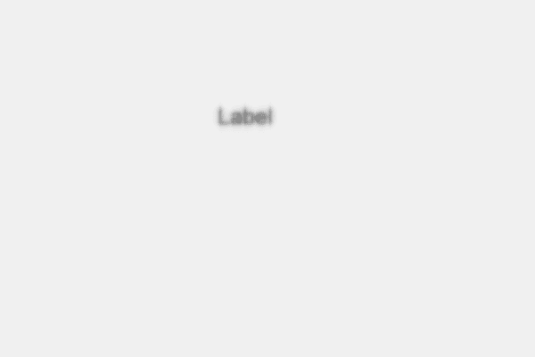

# PyQt5 QLabel–添加模糊效果

> 原文:[https://www . geeksforgeeks . org/pyqt 5-qlabel-添加-模糊-效果/](https://www.geeksforgeeks.org/pyqt5-qlabel-adding-blur-effect/)

在本文中，我们将看到如何为标签添加模糊效果，模糊意味着平滑标签，默认情况下，标签没有模糊效果，尽管我们可以随时添加模糊效果。下图是带有模糊效果的标签表示。



> 为此，我们必须执行以下操作–
> 
> 1.创建标签
> 2。创建 QGraphicsBlurEffect 对象
> 3。借助 setGraphicsEffect 方法将此对象添加到标签中

**语法:**

```py
# creating a blur effect
self.blur_effect = QGraphicsBlurEffect()

# adding blur effect to the label
label.setGraphicsEffect(self.blur_effect)

```

下面是实现

```py
# importing libraries
from PyQt5.QtWidgets import * 
from PyQt5 import QtCore, QtGui
from PyQt5.QtGui import * 
from PyQt5.QtCore import * 
import sys

class Window(QMainWindow):

    def __init__(self):
        super().__init__()

        # setting title
        self.setWindowTitle("Python ")

        # setting geometry
        self.setGeometry(100, 100, 600, 400)

        # calling method
        self.UiComponents()

        # showing all the widgets
        self.show()

    # method for widgets
    def UiComponents(self):

        # creating label
        label = QLabel("Label", self)

        # setting geometry to the label
        label.setGeometry(200, 100, 150, 60)

        # setting alignment to the label
        label.setAlignment(Qt.AlignCenter)

        # setting font
        label.setFont(QFont('Arial', 15))

        # creating a blur effect
        self.blur_effect = QGraphicsBlurEffect()

        # adding blur effect to the label
        label.setGraphicsEffect(self.blur_effect)

# create pyqt5 app
App = QApplication(sys.argv)

# create the instance of our Window
window = Window()

# start the app
sys.exit(App.exec())
```

**输出:**
