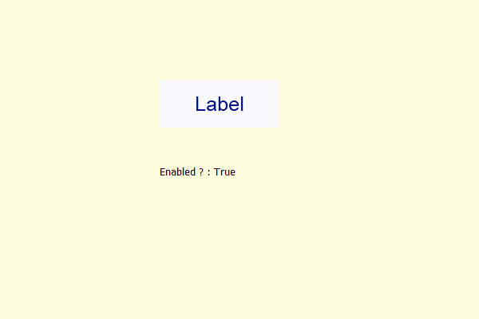

# PyQt5 QLabel–检查颜色效果是否禁用

> 原文:[https://www . geeksforgeeks . org/pyqt 5-qlabel-检查颜色效果是否禁用/](https://www.geeksforgeeks.org/pyqt5-qlabel-checking-if-the-color-effect-is-disabled-or-not/)

在本文中，我们将了解如何检查标签的颜色效果是否被禁用。为了使颜色效果失效，我们使用`setEnable`方法。

为了检查颜色效果是禁用还是启用，我们使用`isEnable`方法。

> **语法:** color_effect.isEnabled()
> 
> **论证:**不需要论证
> 
> **返回:**返回 bool

下面是实现

```
# importing libraries
from PyQt5.QtWidgets import * 
from PyQt5 import QtCore, QtGui
from PyQt5.QtGui import * 
from PyQt5.QtCore import * 
import sys

class Window(QMainWindow):

    def __init__(self):
        super().__init__()

        # making background color light yellow
        self.setStyleSheet("background : lightyellow;")

        # setting title
        self.setWindowTitle("Python ")

        # setting geometry
        self.setGeometry(100, 100, 600, 400)

        # calling method
        self.UiComponents()

        # showing all the widgets
        self.show()

    # method for widgets
    def UiComponents(self):

        # creating label
        label = QLabel("Label", self)

        # setting geometry to the label
        label.setGeometry(200, 100, 150, 60)

        # setting alignment to the label
        label.setAlignment(Qt.AlignCenter)

        # setting font
        label.setFont(QFont('Arial', 15))

        # creating a color effect
        self.color_effect = QGraphicsColorizeEffect()

        # setting color to color effect
        self.color_effect.setColor(Qt.darkBlue)

        # adding color effect to the label
        label.setGraphicsEffect(self.color_effect)

        # creating result label
        result = QLabel(self)

        # setting geometry to the result
        result.setGeometry(200, 200, 300, 30)

        # checking if color effect is enabled
        check = self.color_effect.isEnabled()

        # setting text to result label
        result.setText("Enabled ? : " + str(check))

# create pyqt5 app
App = QApplication(sys.argv)

# create the instance of our Window
window = Window()

# start the app
sys.exit(App.exec())
```

**输出:**
